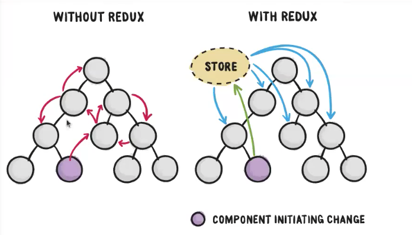
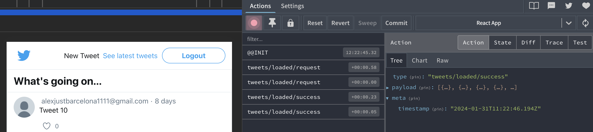
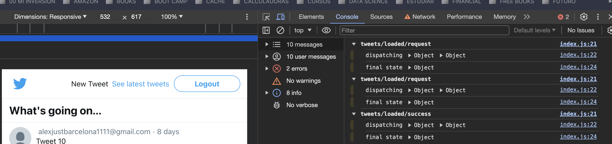

> [!NOTE] 
> SLIDES -> https://github.com/alexjust-data/FullStack07_React_app_tweeter_REDUX/blob/main/Redux.pdf
> 
> Teacher :   
> David https://github.com/davidjj76  
> Discord : https://discord.com/channels/1112689497642115172/1112689499605049377
>
> Refactorizamos : https://github.com/KeepCodingWeb15/twitter-react/tree/redux  
> En la nueva rama : https://github.com/KeepCodingWeb15/twitter-react/tree/rtk
> 
> https://github.com/KeepCodingWeb15  


Partimos de las clases del repositorio de fundamentos React, de la rama creada `rtk`


```sh
git clone -b rtk https://github.com/KeepCodingWeb15/twitter-react.git
cd twitter-react 
  twitter-react git:(rtk) 
```

Arranco Sparrest


```sh
➜  cd '/Volumes/G-DRIVE with Thunderbolt/BOODCAMP/sparrest.js'
➜  sparrest git:(main) ✗ npm start                                            

> sparrest@1.0.0 start
> node index.js

JSON Server is running on port 8001
```

Arranco la aplicación


```sh
npm start

Compiled successfully!

You can now view twitter-react in the browser.

  Local:            http://localhost:3000
  On Your Network:  http://192.168.1.112:3000

Note that the development build is not optimized.
To create a production build, use npm run build.

webpack compiled successfully
```

---

> [!NOTE]
> A partir de ahora es una continuacion de mis apuntes que parten del repo :
> https://github.com/alexjust-data/FullStack07_React_app_tweeter_REDUX.git 


# Redux toolkits (React Redux app)
> [!WARNING]  
> Vamos a refectorizar toda la app con https://redux-toolkit.js.org/


```sh
npm install @reduxjs/toolkit
```

Me voy a cargar la dependencia que ya teníamos instalada porque ya viene con `@reduxjs/toolkit` por defecto


```json
"@redux-devtools/extension": "^3.3.0",
"redux": "^5.0.1",
"redux-thunk": "^3.1.0",
```

```sh
# elimino carpeta y contenidos
rm -rf node_modules

# instalo todas las dependencias listadas (creo node_modules)
npm i
```

## Dependencias de la creación del estado

`store/index.js`

```js
// ANTES
import { createStore, combineReducers, applyMiddleware } from 'redux';
import { withExtraArgument } from 'redux-thunk';
import { composeWithDevTools } from '@redux-devtools/extension';

import * as reducers from './reducers';
import * as actionCreators from './actions';
import * as tweets from '../pages/tweets/service';
import * as auth from '../pages/auth/service';

// DESPUES
import { configureStore as rtkConfigureStore } from '@reduxjs/toolkit';

import * as reducers from './reducers';
import * as actionCreators from './actions';
import * as tweets from '../pages/tweets/service';
import * as auth from '../pages/auth/service';
```

En realidad vamos a seguir configurando nuestra función `configureStore` que será más sencillo porque hay cosas que ya estarán hechas.

```js
// ANTES 
export default function configureStore(preloadedState, { router }) {
  const middleware = [
    withExtraArgument({ api: { auth, tweets }, router }),
    timestamp,
    failureRedirects(router, { 401: '/login', 404: '/404' }),
    logger,
    noAction,
  ];
  const store = createStore(
    reducer: historyReducer(combineReducers(reducers));
    preloadedState,
    composeEnhancers(applyMiddleware(...middleware)),
  );
  return store;
}

/**
 * El Store se crea llamando al paquete store = rtkConfigureStore
 * Propiedades : 
 * - reducer: reducers (el objeto con todos nuestros reducers)
 * - preloadedState,
 * - Por defecto el Thunk ya está, te lo da hecho
 **/


// DESPUES sin middelware
export default function configureStore(preloadedState, { router }) {
  const extraMiddleware = [
    timestamp,
    failureRedirects(router, { 401: '/login', 404: '/404' }),
    successRedirects(router),
    logger,
  ];
  const store = rtkConfigureStore({
    reducer: reducers,
    preloadedState,
    devTools: { // si no pasamos nada en middelware
      actionCreators
    }
  });
  return store;
}

// DESPUES con middelware que nos hacemos cargo nosotros
export default function configureStore(preloadedState, { router }) {
  const extraMiddleware = [
    timestamp,
    failureRedirects(router, { 401: '/login', 404: '/404' }),
    successRedirects(router),
    logger,
  ];
  const store = rtkConfigureStore({
    reducer: reducers,
    preloadedState,
    middleware: getDefaultMiddleware => 
      getDefaultMiddleware({ 
        // Configuración específica para el middleware predeterminado.
        thunk: { extraArgument: { api: { auth, tweets } } }, // Configuración adicional para el middleware thunk, como argumentos extra.
        serializableCheck: false, // Útil si se manejan datos no serializables en las acciones.
      }).concat(extraMiddleware), // Añade middleware adicional usando 'concat'.

    // potenciadores : 'enhancers' es una función que recibe 'getDefaultEnhancers'.
    enhancers: getDefaultEnhancers => 
      getDefaultEnhancers().concat(historyEnhancer), // Añade potenciadores adicionales usando 'concat'.
});
  return store;
}
```

comprueba que toda vaya bien


```sh
npm start
```

los estados están funcionando y estamos guardando el history, entonces funciona el `enhancers` para el `historyEnhancer`



```js
    enhancers: getDefaultEnhancers =>
      getDefaultEnhancers().concat(historyEnhancer),
```

Las acciones tienen el meta con el timestamp, luego su middelware está funcionando



```sh
export default function configureStore(preloadedState, { router }) {
  const extraMiddleware = [
    timestamp,
```

En consola vemos como están los console, entonces `logger` está funcionando



```sh
export default function configureStore(preloadedState, { router }) {
  const extraMiddleware = [
    timestamp,
    failureRedirects(router, { 401: '/login', 404: '/404' }),
    successRedirects(router),
    logger,
  ];
```

Pues con esto ya tenemos todo lo que teníamos habiendo quitado todas las dependencias. No necesitamos ni las devTools otras cosas, pero tenemos que configurar el middelware. Y aún así tenemos acceso a todo igual que si hiciéramos a mano como anteriormente.

## Trabajando el fichero de acciones

`store/actions.js`

utilidad `createAction`

```js
import { createActions } from '@reduxjs/toolkit';

import { areTweetsLoaded, getTweet } from './selectors';
import {
  AUTH_LOGIN_FAILURE,
  AUTH_LOGIN_REQUEST,
  AUTH_LOGIN_SUCCESS,
  AUTH_LOGOUT,
  TWEETS_CREATED_REQUEST,
  TWEETS_CREATED_SUCCESS,
  TWEETS_CREATED_FAILURE,
  TWEETS_DETAIL_FAILURE,
  TWEETS_DETAIL_REQUEST,
  TWEETS_DETAIL_SUCCESS,
  TWEETS_LOADED_FAILURE,
  TWEETS_LOADED_REQUEST,
  TWEETS_LOADED_SUCCESS,
  UI_RESET_ERROR,
} from './types';
```

Para crear una acción con `createActions`, por ejemplo esta 

```js
// ANTES
export const authLoginFailure = error => ({
  type: AUTH_LOGIN_FAILURE,
  error: true,
  payload: error,
});

// DESPUES (le cambio el nombre auth/loginFailure)
export const authLoginFailure = createAction('auth/loginFailure', error => ({
  error: true,
  payload: error,
}));
```

```js
// ANTES
export const uiResetError = () => ({ type: UI_RESET_ERROR });

// DESPUES
export const uiResetError =  createAction('iu/resetError');
```

Ahora podríamos eliminar estos `types` de actions

```js
import {
  // AUTH_LOGIN_FAILURE,
  AUTH_LOGIN_REQUEST,
  AUTH_LOGIN_SUCCESS,
  AUTH_LOGOUT,
  TWEETS_CREATED_REQUEST,
  TWEETS_CREATED_SUCCESS,
  TWEETS_CREATED_FAILURE,
  TWEETS_DETAIL_FAILURE,
  TWEETS_DETAIL_REQUEST,
  TWEETS_DETAIL_SUCCESS,
  TWEETS_LOADED_FAILURE,
  TWEETS_LOADED_REQUEST,
  TWEETS_LOADED_SUCCESS,
  // UI_RESET_ERROR,
} from './types';
``` 

Es decir que podríamos eliminar de `types.js`

```js
export const AUTH_LOGIN_FAILURE = 'auth/login/failure';
export const UI_RESET_ERROR = 'ui/reset_error';
```

Pero fíjate que en `reducers.js` estabamos utilizando 

```js
import {
  AUTH_LOGIN_SUCCESS,
  AUTH_LOGOUT,
  TWEETS_CREATED_SUCCESS,
  TWEETS_DETAIL_SUCCESS,
  TWEETS_LOADED_SUCCESS,
  UI_RESET_ERROR, // <-----
} from './types';


// ANTES
export function ui(state = defaultState.ui, action) {
  if (action.error) {
    return { isFetching: false, error: action.payload };
  }

  if (action.type.endsWith('/request')) {
    return { isFetching: true, error: null };
  }

  if (action.type.endsWith('/success')) {
    return { isFetching: false, error: null };
  }

  if (action.type === UI_RESET_ERROR) { // <-----
    return { ...state, error: null };
  }

  return state;
}

///DESPUES 
export function ui(state = defaultState.ui, action) {
  if (action.error) {
    return { isFetching: false, error: action.payload };
  }

  if (action.type.endsWith('/request')) {
    return { isFetching: true, error: null };
  }

  if (action.type.endsWith('/success')) {
    return { isFetching: false, error: null };
  }

  if (action.type === uiResetError.type) { // <----- uiResetError está exportada 
    return { ...state, error: null };
  }

  return state;
}
```

lo que hace `createAction('iu/reset_error');` en action es crear una funcion asociado al type y me develve esa funcion con el type.

Ahora podríamos ir refactorizando para acción hasta elimnar todos los types en `actions.js`.

Tampoco voy a cambiar todas las acciones. ¿Por qué? Porque si cambio todas las acciones ahora establecen un trabajo que luego lo voy a eliminar, este digamos, sería cuando tú tienes un proyecto en Redux y lo vas a pasar en un Toolkit. Puede ser más o menos ambicioso. ¿Puedes hacer un refactor más profundo o puedes hacer un refactor más o menos depende de lo que necesites.Si solo necesitas refactorizar un poco las acciones créate hacienda es suficiente.Pero luego, cuando empecemos a utilizar, ya te reduces, vamos a ver, incluso las acciones nos las van a dar creadas, entonces no vamos a necesitar acribilización.Sería como un primer paso para empezar a jugar con riesgos Turquía y ver que oye, mira, puedo crearme las acciones o si en algún momento necesito crear una acción, aisladamente que voy a manejar cuando sé de alguna manera. Especial pues lo utilizaré pero luego para empecemos a ver los crea Te reduce vamos a ver que incluso estas acciones estas acciones las vamos a las vamos a quitar de acuerdo.

**2do paso, como se utiliza createReducer para crear reducers**

`reducer.js`

```js
// import { uiResetError } from './actions';
// import {
//   AUTH_LOGIN_SUCCESS,
//   AUTH_LOGOUT,
//   TWEETS_CREATED_SUCCESS,
//   TWEETS_DETAIL_SUCCESS,
//   TWEETS_LOADED_SUCCESS,
// } from './types';

// DESPUES
import { createReducer } from '@reduxjs/toolkit';
import {
  TWEETS_CREATED_SUCCESS,
  TWEETS_DETAIL_SUCCESS,
  TWEETS_LOADED_SUCCESS,
} from './types';
```

```js
// export function auth(state = defaultState.auth, action) {
//   switch (action.type) {
//     case AUTH_LOGIN_SUCCESS:
//       return true;
//     case AUTH_LOGOUT:
//       return false;
//     default:
//       return state;
//   }
// }

// DESPUES
import { authLoginSuccess } from './actions';

export const auth = createReducer(defaultState.auth, builder => {
  builder
    .addCase(authLoginSuccess, () => true) // Añadir caso
});
```

podrías irte a `actions.js` y hacer

```js
// ANTES
export const authLogout = () => ({
  type: AUTH_LOGOUT,
});

// DESPUES
import { authLoginSuccess, authLogout} from './actions';

export const authLogout = createAction('auth/logout');
```
entonces

`reducer.js`

```js
// DESPUES

import { createReducer } from '@reduxjs/toolkit';
import { authLoginSuccess, authLogout } from './actions';


export const auth = createReducer(defaultState.auth, builder => {
  builder
    .addCase(authLoginSuccess, () => true) // Añadir caso
    .addCase(authLogout, () => false); // Añadir caso
});
```
el nombre de las acciones los hemos añadido en cada `action` y esto es que nos podemos ir cargado TYPES que a no necesitamos

```JS
import {
  // AUTH_LOGIN_SUCCESS,
  // AUTH_LOGOUT,
  TWEETS_CREATED_SUCCESS,
  TWEETS_DETAIL_SUCCESS,
  TWEETS_LOADED_SUCCESS,
} from './types';
```

Ahpra vete al Browser y comprueba si funciona en login y logput con redux.

Sigamos con `ui`

`reducer`

```js
// export function ui(state = defaultState.ui, action) {
//   if (action.error) {
//     return { isFetching: false, error: action.payload };
//   }

//   if (action.type.endsWith('/request')) {
//     return { isFetching: true, error: null };
//   }

//   if (action.type.endsWith('/success')) {
//     return { isFetching: false, error: null };
//   }

//   if (action.type === uiResetError.type) {
//     return { ...state, error: null };
//   }

//   return state;
// }

// DESPUES
const isActionError = action => action.error; // verifica si una acción tiene un error.
const isRequestAction = action => action.type.endsWith('/request'); // verifica si el tipo de una acción termina en '/request'.
const isSuccessAction = action => action.type.endsWith('/success'); // si el tipo de una acción termina en '/success'.

// Exporta el reducer 'ui', que manipula el estado de la interfaz de usuario.
export const ui = createReducer(defaultState.ui, builder => {
  builder
    // Maneja la acción 'uiResetError', estableciendo el error en el estado como null.
    .addCase(uiResetError, state => {
      state.error = null;
    })
    // Añade un manejador para cualquier acción que cumpla con 'isActionError'.
    // Establece 'isFetching' en false y actualiza el estado del error con el payload de la acción.
    .addMatcher(isActionError, (state, action) => {
      state.isFetching = false;
      state.error = action.payload;
    })
    // Añade un manejador para acciones que cumplan con 'isRequestAction'.
    // Establece 'isFetching' en true y resetea el error a null.
    .addMatcher(isRequestAction, state => {
      state.isFetching = true;
      state.error = null;
    })
    // Añade un manejador para acciones que cumplan con 'isSuccessAction'.
    // Establece 'isFetching' en false y resetea el error a null.
    .addMatcher(isSuccessAction, state => {
      state.isFetching = false;
      state.error = null;
    });
});

```

**Manejando lo Thunk con ReduxToolKit**

Tiene este utilidad `create `

`actions`

```js
// import { createAction } from '@reduxjs/toolkit';
import { createAction, createAsyncThunk } from '@reduxjs/toolkit';

import { areTweetsLoaded, getTweet } from './selectors';
import {
  AUTH_LOGIN_REQUEST,
  AUTH_LOGIN_SUCCESS,
  AUTH_LOGOUT,
  TWEETS_CREATED_REQUEST,
  TWEETS_CREATED_SUCCESS,
  TWEETS_CREATED_FAILURE,
  TWEETS_DETAIL_FAILURE,
  TWEETS_DETAIL_REQUEST,
  TWEETS_DETAIL_SUCCESS,
  TWEETS_LOADED_FAILURE,
  TWEETS_LOADED_REQUEST,
  TWEETS_LOADED_SUCCESS,
} from './types';

export const authLoginRequest = () => ({
  type: AUTH_LOGIN_REQUEST,
});

export const authLoginSuccess = () => ({
  type: AUTH_LOGIN_SUCCESS,
});

export const authLoginFailure = createAction('auth/login/failure', error => ({
  error: true,
  payload: error,
}));

// export function authLogin(credentials) {
//   return async function (dispatch, getState, { api: { auth }, router }) {
//     try {
//       dispatch(authLoginRequest());
//       await auth.login(credentials);
//       dispatch(authLoginSuccess());
//       const to = router.state.location.state?.from?.pathname || '/';
//       router.navigate(to);
//     } catch (error) {
//       dispatch(authLoginFailure(error));
//     }
//   };
// }

export const authLogin = createAsyncThunk(
  'auth/login',                    // Identificador único para la acción asíncrona, usado en los reducers.
  (
    credentials,                   // Argumento para la función, en este caso, las credenciales del usuario.
    {
      extra: {                     // Desestructuración del campo 'extra' del segundo argumento.
        api: { auth },             // Extrae 'auth' del objeto 'api' en el campo 'extra'.
        router,                    // Extrae 'router' del campo 'extra'.
      },
      rejectWithValue,             // Función para devolver un valor rechazado personalizado.
    },
  ) =>
    auth
      .login(credentials)          // Llama a la función de login en 'auth' con 'credentials'.
      .then(() => {                // Maneja la respuesta exitosa.
        const to = router.state.location.state?.from?.pathname || '/';
                                    // Determina la ruta a la que navegar después del login.
        router.navigate(to);        // Navega a la ruta especificada.
      })
      .catch(rejectWithValue),      // En caso de error, pasa el error a 'rejectWithValue'.
);
```

Ya con esto, lo importante es que estas 3 acciones ya no me hacen falta

```js
export const authLoginRequest = () => ({
  type: AUTH_LOGIN_REQUEST,
});

export const authLoginSuccess = () => ({
  type: AUTH_LOGIN_SUCCESS,
});

export const authLoginFailure = createAction('auth/login/failure', error => ({
  error: true,
  payload: error,
}));
```

quedando el codigo así

```js
import { createAction, createAsyncThunk } from '@reduxjs/toolkit';

import { areTweetsLoaded, getTweet } from './selectors';
import {
  TWEETS_CREATED_REQUEST,
  TWEETS_CREATED_SUCCESS,
  TWEETS_CREATED_FAILURE,
  TWEETS_DETAIL_FAILURE,
  TWEETS_DETAIL_REQUEST,
  TWEETS_DETAIL_SUCCESS,
  TWEETS_LOADED_FAILURE,
  TWEETS_LOADED_REQUEST,
  TWEETS_LOADED_SUCCESS,
} from './types';

export const authLogin = createAsyncThunk(
  'auth/login',
  (
    credentials,
    {
      extra: {
        api: { auth },
        router,
      },
      rejectWithValue,
    },
  ) =>
    auth
      .login(credentials)
      .then(() => {
        const to = router.state.location.state?.from?.pathname || '/';
        router.navigate(to);
      })
      .catch(rejectWithValue),
);
```

Ahora en `reducers` 

```js
// ANTES
export const auth = createReducer(defaultState.auth, builder => {
  builder
    .addCase(authLoginSuccess, () => true)
    .addCase(authLogout, () => false);
});

const isActionError = action => action.error;
const isRequestAction = action => action.type.endsWith('/request');
const isSuccessAction = action => action.type.endsWith('/success');

// DESPUES
export const auth = createReducer(defaultState.auth, builder => {
  builder
    .addCase(authLogin.fulfilled, () => true)
    .addCase(authLogout.fulfilled, () => false);
});

const isActionError = action => action.error;
const isRequestAction = action => action.type.endsWith('/pending');
const isSuccessAction = action => action.type.endsWith('/fulfilled');
```

`pages/auth/AuthButton.js`

```js
// import { logout } from '../service';

// ANTES
function AuthButton({ className, onLogout, isLogged }) {
  const handleLogoutClick = async () => {
    await logout();
    onLogout();
  };

// DESPUES
function AuthButton({ className, onLogout, isLogged }) {
  const handleLogoutClick = () => {
    onLogout();
  };
```

`actions.js`

```js
// ANTES
export const authLogout = createAction('auth/logout');

// DESPUES
export const authLogout = createAsyncThunk(
  'auth/logout', (_, {extra: {api: { auth },},},) => auth.logout(),
);
```


