> [!NOTE] 
> SLIDES -> https://github.com/alexjust-data/FullStack07_React_app_tweeter_REDUX/blob/main/Redux.pdf
> 
> Teacher :   
> David https://github.com/davidjj76  
> Discord : https://discord.com/channels/1112689497642115172/1112689499605049377
> 
> https://github.com/KeepCodingWeb15/twitter-react/tree/redux  
> https://github.com/KeepCodingWeb15  

Partimos del repositorio de fundamentos React, de la rama creada `redux`

```sh
git clone -b redux https://github.com/KeepCodingWeb15/twitter-react.git
```

Arranco Sparrest

```sh
➜  cd '/Volumes/G-DRIVE with Thunderbolt/BOODCAMP/sparrest.js'
➜  sparrest git:(main) ✗ npm start                                            

> sparrest@1.0.0 start
> node index.js

JSON Server is running on port 8001
```

Arranco la aplicación

```js
npm start

Compiled successfully!

You can now view twitter-react in the browser.

  Local:            http://localhost:3000
  On Your Network:  http://192.168.1.112:3000

Note that the development build is not optimized.
To create a production build, use npm run build.

webpack compiled successfully
```

# Redux

Redux es una biblioteca popular de JavaScript para la gestión del **estado** en aplicaciones web, y es comúnmente utilizada junto con bibliotecas o frameworks como React.

> en el desarrollo de aplicaciones web y móviles, el "estado" es un concepto fundamental que se refiere a la información o los datos que una aplicación mantiene en un momento dado. El estado puede cambiar a lo largo del tiempo en respuesta a las acciones del usuario o a otros eventos.
> 
> **Características del Estado en una Aplicación**
> 
> * **Dinámico**: El estado puede cambiar a lo largo del tiempo. Por ejemplo, el estado de una aplicación puede cambiar cuando un usuario llena un formulario, cuando se reciben datos de una API, o cuando el usuario interactúa con la interfaz.
> * **Local o Global**: El estado puede ser local (limitado a un componente o parte específica de la aplicación) o global (disponible en toda la aplicación). En el contexto de React, por ejemplo, un estado local se maneja generalmente dentro de un componente, mientras que un estado global puede ser manejado por contextos o bibliotecas como Redux.
> * **Persistente o Efímero**: Algunos estados son persistentes, lo que significa que se guardan y se mantienen incluso después de cerrar la aplicación, como los datos de usuario guardados en una base de datos o almacenamiento local. Otros estados son efímeros y solo existen mientras la aplicación está activa, como el estado de un formulario antes de enviarlo.
>
>**Ejemplos de Estado en una Aplicación**
>
> * **Estado de la Interfaz de Usuario**: Por ejemplo, si un menú está abierto o cerrado, si un modal está activo, el valor actual de un campo de texto, etc.
> * **Datos del Usuario**: Información sobre el usuario actual, como sus preferencias, configuración, o estado de autenticación.
>
> * **Datos de la Aplicación**: Cualquier dato que la aplicación necesita para funcionar, como los resultados de una llamada a una API, una lista de elementos de un carrito de compras, etc.
>
>Gestión del Estado
>La gestión del estado es un aspecto crucial del desarrollo de aplicaciones, ya que determina cómo se comporta una aplicación en respuesta a diversas entradas y eventos. Las aplicaciones modernas utilizan varios enfoques y herramientas para manejar el estado de manera eficiente y efectiva, tales como useState en React, Vuex en Vue.js, o NgRx en Angular.


**¿Qué es Redux?**

Redux proporciona una forma de centralizar el estado y la lógica de una aplicación, lo que facilita el rastreo y la manipulación del estado a lo largo de toda la aplicación. En una aplicación de React sin Redux, el estado se gestiona típicamente en los componentes individuales, lo que puede llevar a una gestión del estado dispersa y complicada, especialmente en aplicaciones grandes y complejas.

¿Qué aporta Redux en proyectos de React?

1. **Gestión del Estado Predecible**: Redux ayuda a mantener el estado de tu aplicación en un solo lugar (el "store") y controla cómo ese estado se actualiza a lo largo del tiempo, haciendo que el estado de tu aplicación sea más predecible.
2. **Mantenibilidad Mejorada**: Al centralizar el estado y la lógica de la aplicación, Redux hace que el código sea más fácil de mantener. Los desarrolladores saben dónde encontrar y cómo modificar el estado de la aplicación.
3. **Depuración Más Fácil**: Redux ofrece herramientas poderosas para la depuración, como la habilidad de rastrear cada cambio en el estado a través de "acciones" y "reducers". Esto hace que sea más fácil entender cómo y cuándo cambió el estado.
4. **Persistencia del Estado y SSR**: Facilita la implementación de funcionalidades como la persistencia del estado (guardar el estado en el almacenamiento local del navegador) y el renderizado del lado del servidor (Server-Side Rendering, SSR), lo que puede ser complejo de manejar en aplicaciones grandes.
5. **Desacoplamiento de la Lógica de Estado**: Permite separar la lógica del estado y la UI, lo que puede llevar a un diseño de aplicación más claro y a una mejor separación de preocupaciones.
6. **Ecosistema y Comunidad**: Redux tiene un gran ecosistema y comunidad, con muchas bibliotecas y herramientas complementarias que pueden ayudar a resolver problemas comunes de manera eficiente.
7. **Facilita la Colaboración**: Al tener un enfoque estandarizado para manejar el estado, facilita la colaboración entre desarrolladores en un proyecto.

Consideraciones

* **Complejidad Adicional**: Para proyectos pequeños o simples, Redux puede ser excesivo y añadir una complejidad innecesaria.
* **Curva de Aprendizaje**: Aprender Redux lleva tiempo, especialmente para entender conceptos como reducers, middleware, store, acciones, etc.
* **Alternativas**: Con las recientes actualizaciones en React (como Context API y Hooks), algunas aplicaciones pueden no necesitar Redux para una gestión eficiente del estado. Sin embargo, Redux sigue siendo una opción sólida para aplicaciones complejas y de gran escala.


Instalemos esta extension en el navegador:

https://chromewebstore.google.com/detail/redux-devtools/lmhkpmbekcpmknklioeibfkpmmfibljd

INstalamos Redus

```sh
npm install redux --save
```

Creo carpeta `scr/store/index.js`

```js
import { createStore } from 'redux';         // nos permite crear un almacenredux

const reducer = (state = 0, action) => {     // función q decide como aplicar los cambios de estado
  // implement state logic                   // recibo valor del estado y la acción
  switch (action.type) {
    case 'increment':
      return state + 1;
    case 'decrement':
      return state - 1;
    default:
      return state;
  }
};

const store = createStore(reducer);           // nos creamos el almacen

console.log({store}); // vamos a ver que tiene
```

Voy al `index.js` y lo importo `import './store'; `

Por consola la aplicacoin nos enseña que es `store`

```sh
store: 
    @@observable: ƒ observable()
    dispatch:ƒ dispatch(action)
    getState: ƒ getState()
    replaceReducer: ƒ replaceReducer(nextReducer)
    subscribe: ƒ subscribe(listener)
    [[Prototype]]: Object
    [[Prototype]]: Object
```

Es un objeto con tres métodos `getState()` , `subscribe(listener)` , `dispatch(action)`

```js
import { createStore } from 'redux';

const reducer = (state = 0, action) => {
  // implement state logic
  switch (action.type) {
    case 'increment':
      return state + 1;
    case 'decrement':
      return state - 1;
    default:
      return state;
  }
};

const store = createStore(reducer);

// cada vez que se produzco un cambio deribado de una accion ejecuta esta función
const callback = () => console.log('state', store.getState());
store.subscribe(callback); // me suscribo "acuerdate de llamarme cuando tengas un cambio"
callback();                // lanzo callback para ver mi estado por consola 'state 0'

store.dispatch({ type: 'increment' }); // ejecuto accion de incremento state 1
store.dispatch({ type: 'decrement' }); // ejecuto accion de decremento state 0
```

## Creando nuestro propio **createStore**

Es una funcion que devuelve tres métodos `getState()` , `subscribe(listener)` , `dispatch(action)`

```js
// import { createStore } from 'redux';

function createStore(reducer) {
  let state;                        // almacenamos el estado
  let listeners = [];               // cada vez que se suscriban guardamos

  function getState() {             // simplememntodevuelve el valor del estado
    return state;
  }

  function dispatch(action) {       
    state = reducer(state, action); // la logica está en reducer, sabe qué hacer con state y la accion
    listeners.forEach(l => l());    // por cada elemento lo ejecuta l()
  }

  function subscribe(listener) {    
    listeners.push(listener);       // almacenamos en el array

    return function () {            // filtra todos los listeners menos el que te he enviado
      listeners = listeners.filter(l => !listener);
    };
  }

  dispatch({ type: 'initialization' }); // ará que se ejecuten las funciones

  return {
    getState,
    subscribe,
    dispatch,
  };
}


const reducer = (state = 0, action) => {
  // implement state logic
  switch (action.type) {
    case 'increment':
      return state + 1;
    case 'decrement':
      return state - 1;
    default:
      return state;
  }
};

const store = createStore(reducer);

const callback = () => console.log('state', store.getState());
const unsubscribe = store.subscribe(callback);
callback();

store.dispatch({ type: 'increment' });

unsubscribe();
store.dispatch({ type: 'decrement' });
console.log(store.getState());
```

## Conceptos básicos

**Acciones**

Objetos que representan una intención de cambiar el estado
* Se definen con una propiedad obligatoria type que identifica el tipo de acción
* Pueden contener otros datos que describen completamente la acción (payload)
* Es buena práctica definir los distintos types como constantes, incluso ponerlos en un fichero aparte

Actions creators

Funciones que crean y devuelven acciones:
* Acciones reusables
* Fácilmente testeables
* Mediante middleware, pueden devolver funciones, acceder al estado, ejecutar side-effects (asincronía)…

https://github.com/redux-utilities/flux-standard-action

**Estado**

Lo que no vemos.

El estado puede tener cualquier forma, es responsabilidad nuestra modelar el estado para que se ajuste a la aplicación. Puede ser:
* Un dato primitivo: Number, String, Boolean
* Un Array, Object, o cualquier estructura **serializable** (que puedes enviarlo como objeto string sin perdidas)

**Reducers**

Maneja la logica centrol del estado

Especifican cómo cambia el estado en respuesta a las acciones enviadas al store

* (previousState, action) => newState
* Debe ser una función pura, por lo que no pueden, bajo ningún concepto:
* Mutar sus argumentos
* Ejecutar side-effects (API, BBDD, DOM…)
* Llamar funciones no puras Date.now(), Math.random()
* Fácilmente testeables y predecibles, ya que, a igual estado y acción, siempre generan el mismo estado


**Store**

* Objeto core de Redux, enlaza acciones con reducers
* Guarda el estado de la aplicación
* Permite el acceso al estado con store.getState()
* Permite despachar acciones con store.dispatch(action)
* Registra y mantiene subscripciones con store.subscribe()
* Una vez definido el reducer, crear el store es tan sencillo

**Flujo de datos**

En Redux el flujo de datos es unidireccional
1. Se despacha una acción: store.dispatch(action)
2. El store llama al reducer pasándole el estado y la acción
3. El reducer principal combina el resultado de los diferentes reducers, produciendo el nuevo estado
4. Redux almacena el nuevo estado y llama a los subscriptores para que puedan consultar el valor


> [!IMPORTANT]
> Comenzamos a picar código

Lo primero es pensar qué es lo que queremos almacenar en Redux.
Estructurar el estado
Qué acciones manejar en el estado.

Renombro `store/index.js` -> `index-poc.js`.  
Quito del `index.js` el `import './store'; `

Ahora en `store` vamos a crear varios ficheros:
* actions.js
* types.js
* reducers.js
* index.js (donde almacenamos el store)


Pensemos como queramos el estado: `store/reducers.js`

```js
// mi estado tendrá esta forma
const defaultState = {
  auth: false,
  tweets: [],
};

// defino el reducer
export default function reducer(state = defaultState, action) {
  // ¿qué acciones tiene que tener nuestro estado?
  // acciones que tengan que ver si el usuario está loguado o no
  switch (action.type) {
    case AUTH_LOGIN:            // si está logueado

    case AUTH_LOGOUT:           // si está deslogueado

    case TWEETS_LOADED:         // cargados los tweets

    case TWEETS_CREATED:        // creados los tweets

    default:                    // siempre el eestado por defecto
      return state;
  }
}
```

Voy a `store/types.js` y exporto las acciones

```js
export const AUTH_LOGIN = 'auth/login';
export const AUTH_LOGOUT = 'auth/logout';

export const TWEETS_LOADED = 'tweets/loaded';
export const TWEETS_CREATED = 'tweets/created';
```

```js
import { AUTH_LOGIN, AUTH_LOGOUT, TWEETS_CREATED, TWEETS_LOADED,} from './types';

const defaultState = {
  auth: false,
  tweets: [],
};

export default function reducer(state = defaultState, action) {
  switch (action.type) {
    case AUTH_LOGIN:
      return {
        ...state,    // devuelve nuevo objeto con forma que tenga "defaultState" en ese monento
        auth: true,  // sobreescribo auth
      };
    case AUTH_LOGOUT:
      return {
        ...state,
        auth: false,
      };
    case TWEETS_LOADED:
      return {
        ...state,
        tweets: action.payload, // coje los tweets que te envie y los pones dentro del array
      };

    case TWEETS_CREATED:
    default:
      return state;
  }
}
```

Ahora hemos de ser capaces de despachar estos stores, es decir vamos a crear creadores de acciones.

`actions.js` con `type` estas acciones quedan definidas.

```js
import { AUTH_LOGIN, AUTH_LOGOUT, TWEETS_LOADED } from './types';

export const authLogin = () => ({
  type: AUTH_LOGIN,
});

export const authLogout = () => ({
  type: AUTH_LOGOUT,
});

export const tweetsLoaded = tweets => ({
  type: TWEETS_LOADED,
  payload: tweets,    // hemos dicho que le llgará un payload con los tweets que ha de almacenar
});
```

Fíjate que los tres files tienes que cuadrar, es un contrato entre los tres. Es la base.

Ahora creamos nuesto store `store/index.js`

```js
import { createStore } from 'redux';
import reducer from './reducers';


export default function configureStore() {
  const store = createStore(reducer);
  return store;
}
```

En el indice de la aplicacion `index.js` --> `import configureStore from './store';`

Con esto ya tenemos configurado el store, para verlo la mejor manera es is a las `devTools` para hacer esto hay varias maneras 

https://github.com/reduxjs/redux-devtools

Una vez instalada la extension, verás que te permite pasar más parámetros, para configurarlo puedes introducir esta linea https://github.com/reduxjs/redux-devtools/tree/main/extension#1-with-redux 

Entonces vamos a `store/index.js` y se la ponemos

```js
import { createStore } from 'redux';
import reducer from './reducers';


export default function configureStore() {
  const store = createStore(
    reducer,
    window.__REDUX_DEVTOOLS_EXTENSION__ &&
      window.__REDUX_DEVTOOLS_EXTENSION__(),
  );
  return store;
}
```

Pero hay ora forma de instalarlo 

https://github.com/reduxjs/redux-devtools/tree/main/extension#13-use-redux-devtoolsextension-package-from-npm

`npm install --save @redux-devtools/extension`

```js
import { createStore } from 'redux';

import reducer from './reducers';
import { devToolsEnhancer } from '@redux-devtools/extension';
import * as actionCreators from './actions';

export default function configureStore() {
  const store = createStore(
    reducer,
    devToolsEnhancer({ actionCreators }),
    // window.__REDUX_DEVTOOLS_EXTENSION__ &&
    //   window.__REDUX_DEVTOOLS_EXTENSION__(),
  );
  return store;
}
```


Voy a intentar separar por partes en `Reducer` y conbinarlas luego. independientemente de la accion tenemos que tener claro que mi reducer ha de devolver un objeto que me devuelve un auth y un tweets.

Lo vamos hacer en funciones más pequeñas.

```js
// import combineReducers from 'redux';

import {
  AUTH_LOGIN,
  AUTH_LOGOUT,
  TWEETS_CREATED,
  TWEETS_LOADED,
} from './types';

const defaultState = {
  auth: false,
  tweets: [],
};


export function auth(state = defaultState.auth, action) {
  switch (action.type) {
    case AUTH_LOGIN:
      return true;
    case AUTH_LOGOUT:
      return false;
    default:
      return state;
  }
}

export function tweets(state = defaultState.tweets, action) {
  switch (action.type) {
    case TWEETS_LOADED:
      return action.payload;

    case TWEETS_CREATED:
    default:
      return state;
  }
}

// export default combineReducers({ auth, tweets });

```

`combineReducers` es una funcion de `Redux` que me permite combinar 

me voy a `index.js` e importo `reducers` (auth() y sweet()) y lo combino aquí dentro

```js
import { createStore, combineReducers } from 'redux';

import * as reducers from './reducers';
import { devToolsEnhancer } from '@redux-devtools/extension';
import * as actionCreators from './actions';

export default function configureStore() {
  const store = createStore(
    combineReducers(reducers),
    devToolsEnhancer({ actionCreators }),
    // window.__REDUX_DEVTOOLS_EXTENSION__ &&
    //   window.__REDUX_DEVTOOLS_EXTENSION__(),
  );
  return store;
}
```

> [!NOTE]
> Seguimos ....

Vamos a ver como integramos el `store` de `index.js` con redux en React

```js
import configureStore from './store';
const store = configureStore();
```

Para eso tenemos la librería `react-redux`,  proporciona una forma de conectar componentes de React con un almacén Redux, facilitando la gestión del estado en aplicaciones React. Permite que los componentes accedan al estado de Redux y desencadenen acciones para actualizar ese estado.

```sh
npm i --save react-redux
```
Envielve la palicacion con este componente `<Provider />`   
`connect()` es una funcion que te permite envolver componentes  

Básicamente hará esto:


---
### **1er paso: importar el Provider y pasarle el store**

Lo primero es utilizar el `<Provider />` envolviendo toda la aplicacion para que tengan acceso. Vamos al fichero princial de la app `index.js`

```js
import configureStore from './store';
import { Provider } from 'react-redux'; // importo libreria
const store = configureStore(); // <Provider store={store}>

const accessToken = storage.get('auth');
if (accessToken) {
  setAuthorizationHeader(accessToken);
}

const root = ReactDOM.createRoot(document.getElementById('root'));
root.render(
  <React.StrictMode>
    <ErrorBoundary>
      <Provider store={store}>
        <BrowserRouter>
          <AuthContextProvider initiallyLogged={!!accessToken}>
            <App />
          </AuthContextProvider>
        </BrowserRouter>
      </Provider>
    </ErrorBoundary>
  </React.StrictMode>,
);
``` 

Nosmalmente me creo un componete `Root` para ordenar todo y meterme estos Providers, a la larga me irá bien crearme un componenete que tenga tanto el `</Provider>` como el `</BrowserRouter>`

Me creo `src/Root.js`

```js
import { Provider } from 'react-redux';
import { BrowserRouter } from 'react-router-dom';

export default function Root({ store, children }) {
  return (
    <Provider store={store}>
      <BrowserRouter>{children}</BrowserRouter>
    </Provider>
  );
}
```

Ahora tenemos en `index`

```js
import React from 'react';
import ReactDOM from 'react-dom/client';

import './index.css';
import App from './App';
import storage from './utils/storage';
import { setAuthorizationHeader } from './api/client';
import { AuthContextProvider } from './pages/auth/context';
import ErrorBoundary from './components/errors/ErrorBoundary';

import configureStore from './store';
import Root from './Root';

const store = configureStore();

const accessToken = storage.get('auth');
if (accessToken) {
  setAuthorizationHeader(accessToken);
}

const root = ReactDOM.createRoot(document.getElementById('root'));
root.render(
  <React.StrictMode>
    <ErrorBoundary>
      <Root store={store}>
        <AuthContextProvider initiallyLogged={!!accessToken}>
          <App />
        </AuthContextProvider>
      </Root>
    </ErrorBoundary>
  </React.StrictMode>,
);
``` 
 con esto básicamente lo que le estamos diciendo es que todo lo que esté dentro que básicamente es el `App` va a tener acceso a `store`.

---

Acuérdate ahora que esto, el `accessToken` en el `index.js`...

```js
const accessToken = storage.get('auth');
if (accessToken) {
  setAuthorizationHeader(accessToken);
}
``` 

lo utilizábamos para persistir el token en el logout storage para que si cerraba la pestaña dijera que tiene token e igualmente estaba autenticado, y entonces el `initiallyLogged` del `<AuthContextProvider initiallyLogged={!!accessToken}>` lo pongo en TRUE o FALSE en función de eso. Pero ahora realmente este TRUE o FALSE ya no va a vivir en este componente, ya no va a vivir en nuestro estado local, va a vivir en nuestro `store` de `const store = configureStore();`. POr lo tanto a `configureStore()` le vamos a pasar un valor que ons diga si inicalmente esoty logueado o no.

```js
const store = configureStore({ auth: !!accessToken });
```

Entonces recibimos este objeto de configuración en su function correspondiente en el `index` y lo pasamos en `createStore()` como segundo parámetro

```js
export default function configureStore(preloadedState) {
  const store = createStore(
    combineReducers(reducers), //1er parámetro el reducers
    preloadedState,            //2do puede ir o no el preloadedState
    devToolsEnhancer({ actionCreators }), // los mejoradores del store
  );
  return store;
}
```

> [!NOTE]
> Acuérdate que inicalmente cuando configuramos nuestro propio **CreateState** es lo mismo que si yo lo configuraba pasándole al state el preloaded , así `index-poc`
```js
function createStore(reducer, preloadedState) {
  let state = preloadedState;
  let listeners = [];

  ...
```
---

Entonces ya tengo la capacidad de leer de mi local storage y configurar el estado de inicio con lo que yo haya leído.

```js
const accessToken = storage.get('auth');
if (accessToken) {
  setAuthorizationHeader(accessToken);
}

const store = configureStore({ auth: !!accessToken });
```

Ahora si te vas al browser de la app verás que no tienes token, pero si te creas uno nuevo inventado


verás que en la extension de Redux y recargas la aplicacino tienes `auth: true,`


Es exactamente la misma folosofía de antes cuando iniciábamos el estado de login pero lo hacemos a traves de este parámetro `preloadedState`.

---

### **2do paso : Despachando acciones**

**Despacharemos el login**

Recordando lo secuencia del login lo que hacía era en `loginPage.js` hacia en `handleSubmit` un `submit` con las credenciales

```js
  const handleSubmit = async event => {
    event.preventDefault();

    try {
      setIsFeching(true);
      await login(credentials); // hace petición al servicio 
      setIsFeching(false);      // cuando se resuelve 
      onLogin();                // llamamos al onLogin()
```

Este `onLogin()` básicamente es el que venía de `constext.js` donde cambiaba el estado en `AuthContextProvider`

```js
export const AuthContextProvider = ({ initiallyLogged, children }) => {
  const [isLogged, setIsLogged] = useState(initiallyLogged);

  const authHandlers = useMemo(
    () => ({
      onLogin: () => setIsLogged(true), 
      onLogout: () => setIsLogged(false),
    }),
    [],
  );
```

Si yo en vez de llamar a `onLogin();` en `handleSubmit` llamo a un `dispach` de login lo que hago es hacer que cuando se cambie el login seré capaz de cambiar el estado con Redux y cuanod se produzca el logout seré de cambiarlo de nuevo.

Vamos al lío...

Para enganchar un componente necesito tener acceso al dispach dentro del componente para ello redux tinene un hoo `useDespatch()`

`LoginPage.js` añado 

```js
import { useDispatch } from 'react-redux';
import { authLogin } from '../../../store/actions';
... 

function LoginPage() {
  const dispatch = useDispatch();
  //const { onLogin } = useAuthHandlers(); // ya no lo necesito
  ... 

  const onLogin = () => {  // me creo esta funcion para sustituir la implementacion
    dispatch(authLogin());
  };
```

entonces este ` dispatch(authLogin());` va a generar la accion llamando a `store/action.js` en la linea 

```js
export const authLogin = () => ({
  type: AUTH_LOGIN,
});
```

esto genera la accion y se la paso a dispatch que me lo da useDispatch(); y `useDispatch();` básicamente lo que hace es conectarse en el contexto donde hemos puesto el store en `Root` en `<Provider store={store}>` lo que hace `Provider` es establecer un contexto y a través de `useDispatch();` se contecta a este contexto y coge el método dispatch.

```js
export default function Root({ store, children }) {
  return (
    <Provider store={store}>
```

Ya tenemos el método del login, en vez de cambiar el estado local, lo que hará será cambiar el estado de login. Ahora vete a la app y haz un login. Te va a disparar la acción.


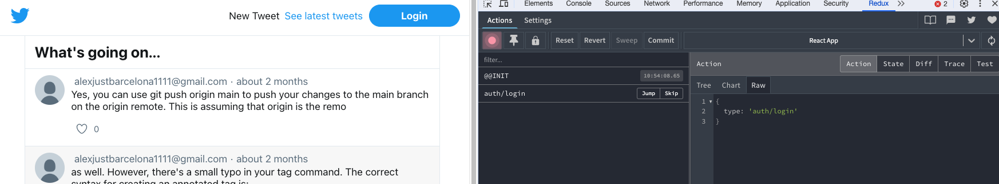

Además tienes tu token real

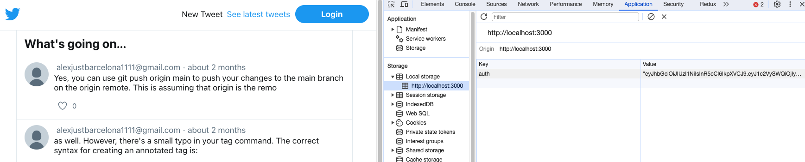


No está navegando pero ya vemos al menos que se despacha. Vamos a por Logout

Teníamos el `Button` en `page/auth/components/AuthButton.js` y lo que hacía era llamar a `useAuthHandlers()` para traérselo a `onLogout` a través del contexto

```js
function AuthButton({ className }) {
  const isLogged = useIsLogged();
  const { onLogout } = useAuthHandlers();

  const handleLogoutClick = async () => {
    await logout();
    onLogout();
  };
  return isLogged ? (
    <Button onClick={handleLogoutClick} className={className}>
      Logout
    </Button>
  ) : (
    <Button as={Link} to="/login" $variant="primary" className={className}>
      Login
    </Button>
  );
}
```

Pues esto lo vamos a cambiar por un `dispatch`

```js
import { Link } from 'react-router-dom';
import Button from '../../../components/shared/Button';
import { useIsLogged } from '../context';
import { logout } from '../service';
import { useDispatch } from 'react-redux';
import { authLogout } from '../../../store/actions';


function AuthButton({ className }) {
  const dispatch = useDispatch();
  const isLogged = useIsLogged();

  const onLogout = () => {
    dispatch(authLogout());
  };

  const handleLogoutClick = async () => {
    await logout();
    onLogout();
  };
  return isLogged ? (
    <Button onClick={handleLogoutClick} className={className}>
      Logout
    </Button>
  ) : (
    <Button as={Link} to="/login" $variant="primary" className={className}>
      Login
    </Button>
  );
}

export default AuthButton;
```

Ahora si te vas a la app hacer un logout lo tendrás en la extension de redux

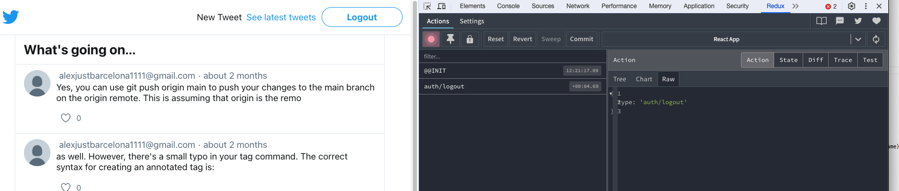

--- 

### **3er paso : selectores** 

Cómo acceder a los componentes no para despacharlos si no para traernos la información que nos interese.

* `connect` : Es una función de orden superior que conecta componentes de React con el store de Redux. Permite acceder al estado y despachar acciones. Se usa principalmente en componentes de clase.. Conecta el componente con el store de Redux. Sirve tanto para traer informacion como apra despacher acciones.
  
* `useSelector` : Es un hook de React-Redux utilizado en componentes funcionales para seleccionar datos del store de Redux. Es más simple y directo comparado con connect y es la forma recomendada de acceder al estado en componentes funcionales.


Vamos a poner un ejemplo de connect. Imagínate que no estás usando `useDispatch();` en el propio `AuthButton`

```js
function AuthButton({ className }) {
  // const dispatch = useDispatch();
  const isLogged = useIsLogged();

  // const onLogout = () => {
  //   dispatch(authLogout());
  // };
```

Entonces lo que haremos será conectarl el `logout` con connect sólamente para poder inyectar una propiedad que será una función similar a esta:

```js
  // const onLogout = () => {
  //   dispatch(authLogout());
  // };
```

Que cuando se ejecute hará el dispatch de la funcion que le digaoms, la forma de uso de connect es mediante 

* 1ra llmada para cofigurar : `connect(mapDispatchToProps, mapDispatchToProps)`
* 2da llamada para envolver el componente : `connect()(AuthButton);`
---
* `mapStateToProps`: extrae datos del estado
* `mapDispatchToProps`: crea funciones que despachan acciones
* `connect()(Component)`: pasa la función dispatch como prop

Vamos a ver `mapDispatchToProps`  en el propio `AuthButton`

```js
export default connect(null, mapDispatchToProps)(AuthButton);
```

Creamos la funcion 

```js
const mapDispatchToProps = {
  onLogout: authLogout,
};

// se la pasamos 
export default connect(null, mapDispatchToProps)(AuthButton);
``` 

Para que conecte con `(AuthButton)` se la hemos le hemos de pasar el dato de `onLogout` como atributo.

```js
import { Link } from 'react-router-dom';
import { connect, useDispatch } from 'react-redux';
import Button from '../../../components/shared/Button';
import { useIsLogged } from '../context';
import { logout } from '../service';
import { authLogout } from '../../../store/actions';


function AuthButton({ className, onLogout }) {
  // const dispatch = useDispatch();
  const isLogged = useIsLogged();

  // const onLogout = () => {
  //   dispatch(authLogout());
  // };

  const handleLogoutClick = async () => {
    await logout();
    onLogout();
  };
  return isLogged ? (
    <Button onClick={handleLogoutClick} className={className}>
      Logout
    </Button>
  ) : (
    <Button as={Link} to="/login" $variant="primary" className={className}>
      Login
    </Button>
  );
}

const mapDispatchToProps = {
  onLogout: authLogout,
};

export default connect(null, mapDispatchToProps)(AuthButton);
```

Ahora si te vas a la app y haces un logout verás como redux conecta y dispara el evento

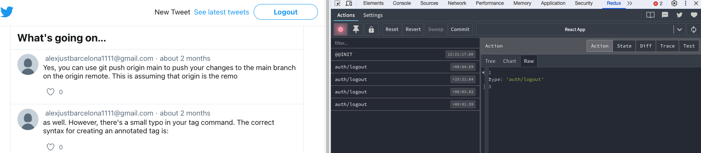

---

Ahora vamos a , mi estado que vivía enteriormente en este CustomHook `const isLogged = useIsLogged();` que lo tenemos en 

`context.js`

```js
const AuthContext = createContext(false);
const AuthContextHandlers = createContext(undefined);

export const useIsLogged = () => {
  const isLogged = useContext(AuthContext);
  return isLogged;
};

export const useAuthHandlers = () => {
  const authHandlers = useContext(AuthContextHandlers);
  return authHandlers;
};

export const AuthContextProvider = ({ initiallyLogged, children }) => {
  const [isLogged, setIsLogged] = useState(initiallyLogged);

  const authHandlers = useMemo(
    () => ({
      onLogin: () => setIsLogged(true),
      onLogout: () => setIsLogged(false),
    }),
    [],
  );

  return (
    <AuthContextHandlers.Provider value={authHandlers}>
      <AuthContext.Provider value={isLogged}>{children}</AuthContext.Provider>
    </AuthContextHandlers.Provider>
  );
};
```
lee el contexto donde tenemos almacenado el estado que almacena el valor de `isLogged`. Pues ahora lo que haremos será cargarnos este estado de aquí y lo llevaremos a Redux.

La manera de leerlo es aprovechar que tengo en `AuthButton.js` el `useIsLogged` y hacer una búsqueda por la app para ver donde modificar, y si lo buscas verás que lo tenemos en `AuthButton` que es el botón para hacer logout; y luego lo tenemos en `RequireAuth.js` que es el componente que protege nuestra ruta para en caso de que to quisiera acceder a un elemento que estaba protegida bajo autentificación enviarlo de vuelta al login. 

¿cómo se lee la informacion en Redux?

* `useSelector` : usada en un componente permite extraer datos de un store redux, usando un selector

Si yo quiero connectar mi componente `RequireAuth` para que lea el estado `isLogged` desde Redux aquí 

```js
import { Navigate, useLocation } from 'react-router';
import { useIsLogged } from '../context';

function RequireAuth({ children }) {
  const location = useLocation();
  const isLogged = useIsLogged();

  return isLogged ? (
    children
  ) : (
    <Navigate to="/login" state={{ from: location }} />
  );
}

export default RequireAuth;
```

lo que tenemos que hacer es esto:

```js
import { useSelector } from 'react-redux';
import { Navigate, useLocation } from 'react-router';
// import { useIsLogged } from '../context';

function RequireAuth({ children }) {
  const location = useLocation();
  // const isLogged = useIsLogged();
  const isLogged = useSelector(state => state.auth);

  return isLogged ? (
    children
  ) : (
    <Navigate to="/login" state={{ from: location }} />
  );
}

export default RequireAuth;
```
Ya tenemos conectado. Y cuando lances una acción se renderizará de nuevo al cambiar el valor de este contexto.

Ahora si te logueas con la app verás que es capaz de redicreccionar 

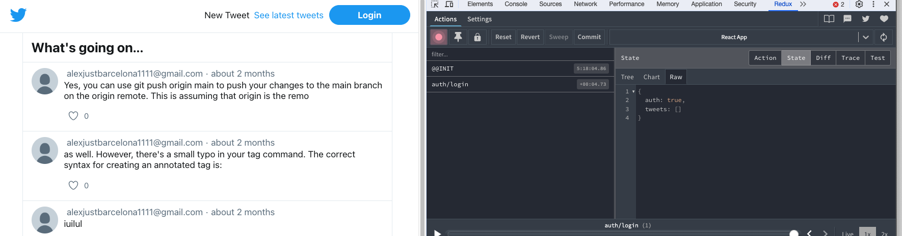

---

> [!NOTE]
> Vamos a seguir con los selectores.  
> Ahora mismo ya tenemos conectado todo lo que tiene que ver con el login que ya se maneja todo con Redux.

Ahora si te fijas en context las funciones que hay ya no se usan, por lo tanto podemos eliminar el archivo. Te dará errores pero con los imports quehas de rectificar. En `index.js` quitamos el componente que ya no usamos `<AuthContextProvider />`

```js
import React from 'react';
import ReactDOM from 'react-dom/client';

import './index.css';
import App from './App';
import storage from './utils/storage';
import { setAuthorizationHeader } from './api/client';
//import { AuthContextProvider } from './pages/auth/context';
import ErrorBoundary from './components/errors/ErrorBoundary';

import configureStore from './store';
import Root from './Root';

const accessToken = storage.get('auth');
if (accessToken) {
  setAuthorizationHeader(accessToken);
}

const store = configureStore({ auth: !!accessToken });

const root = ReactDOM.createRoot(document.getElementById('root'));
root.render(
  <React.StrictMode>
    <ErrorBoundary>
      <Root store={store}>
          <App />
      </Root>
    </ErrorBoundary>
  </React.StrictMode>,
);
```
La app sigue funcionando desde redus y en el browser. Pero podemos ver en Redux que la lista de tweets está vacía `tweets: []`

**Vamos ahora a conectar el listado de tweets**

Vamos al state de `TweetsPage.js` que teníamos este efecto

```js
function TweetsPage() {
  const [tweets, setTweets] = useState([]);

  useEffect(() => {
    getLatestTweets().then(tweets => {
      setTweets(() => {
        return tweets;
      });
    });
  }, []);
```

Y lo que haremos será almacenarlo en Redux. Cuando se resuelva la llamada al Api hacemos un dispatch quedanso así: 

Además hemos de sacar los tweets de Redux ¿como los sacamos de redux? haciendo un `useSelector` 

```js
function TweetsPage() {
  const tweets = useSelector();
  const dispatch = useDispatch();

  useEffect(() => {
    getLatestTweets().then(tweets => {
      dispatch(tweetsLoaded(tweets))
    });
  }, []);
  ...
```
Y me voy a la logica e implemento un selector `store/selector.js`

```js
export const getTweets = state => state.tweets;
```

y se lo enchufo...

```js
function TweetsPage() {
  const tweets = useSelector(getTweets);
  const dispatch = useDispatch();

  useEffect(() => {
    getLatestTweets().then(tweets => {
      dispatch(tweetsLoaded(tweets))
    });
  }, [dispatch]);

  .... 
```
Ya está cargando tweets

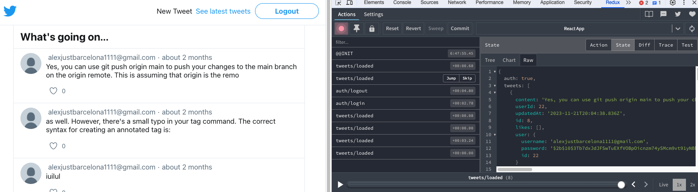


Podríamos utilizar incluso en memoria el listado de tweets, antes los tenía solo en el componente, entonces antes se hacia dificil compartir los tweets entre componentes porque había que hacer peticiones y guardarlos en caché etc

Vamos hacerlo pero no como si siempre fuera bien en una app si no para ver que Redux me permite compartir informacion entre componentes que incluso pueden estar en distints rutas.

1. vamos al detalle que está en el componente `TweetPage.js`

```js
function TweetPage() {
  const params = useParams();
  const navigate = useNavigate();
  const [tweet, setTweet] = useState(null);

  useEffect(() => {
    getTweet(params.tweetId)
      .then(tweet => setTweet(tweet))
      .catch(error => {
        if (error.status === 404) {
          navigate('/404');
        }
      });
  }, [navigate, params.tweetId]);
```

Aquí tenemos una petición que se trae el tweet y lo pone en el stado ... vamos a cambiarlo para que lo saque directamente de Redux.

```js
import { useParams } from 'react-router';
import Content from '../../../components/layout/Content';
import { useSelector } from 'react-redux';

function TweetPage() {
  const params = useParams();

  const tweet = useSelector(); // fíjate que falta pasarle los id de cada anuncnios

  return (
    <Content title="Tweet detail">
      <div>
        Tweet detail {params.tweetId} goes here...
        {tweet && (
          <div>
            <code>{JSON.stringify(tweet)}</code>
          </div>
        )}
      </div>
    </Content>
  );
}

export default TweetPage;
```

Necesito el id de cada twwet entonces en selector le paso la funcion para conseguir esto. El `tweetId` lo que hace es devolver la función que recibe el estado, y esta función que recibe el estado si que se la puedo pasar al `useSelector()`.

```js
// le pasare la funcion : getTweet(params.tweetId)
export const getTweet = tweetId => state =>
  getTweets(state).find(tweet => tweet.id === Number(tweetId));

```

```js
import { useParams } from 'react-router';
import Content from '../../../components/layout/Content';
import { useSelector } from 'react-redux';

function TweetPage() {
  const params = useParams();

  const tweet = useSelector(getTweet(params.tweetId)); // <---- getTweet(params.tweetId)

  return (
    <Content title="Tweet detail">
      <div>
        Tweet detail {params.tweetId} goes here...
        {tweet && (
          <div>
            <code>{JSON.stringify(tweet)}</code>
          </div>
        )}
      </div>
    </Content>
  );
}

export default TweetPage;
```

Ahora si te vas al listado de teewts verás como se carga la peticion 200 

---
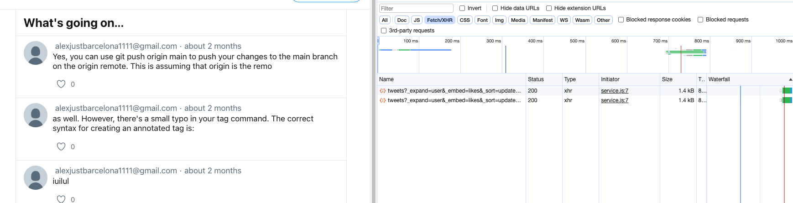

---

Pero si pinchas al detalle se carga el detalla sin la necesidad de pedirlo de nuevo 

---
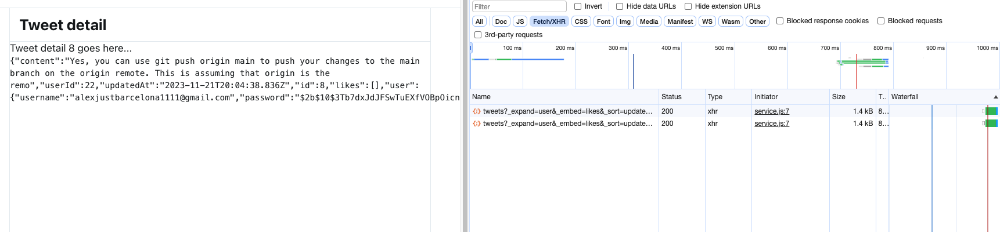

---

Si te fijas las recargas no funcionan todavía, esto es devido a que al app se reinicia de nuevo, pero si te vas al listado `http://localhost:3000/tweets` lo puedes hacer.


> [!IMPORTANT]
> Al final mi store de Redux es como una caché en el navegador de los datos que tengo de la app , que quiero ir comportiendo de la app


Con esto acabamos con redux, en el sentido de que 
* todas las acciones son Sincronas. No podemos de momento manejar ninguna sincronía.


## Conceptos avanzados

* Funciones asíncronas
* Flujo asíncrono
* Middleware
* Uso con React Router


**Funciones asíncronas**

1. Hasta ahora todas las acciones son síncronas, ¿cómo emitimos acciones asíncronas?
2. En peticiones AJAX a APIs identificamos varios momentos y en cada uno de ellos podemos emitir una acción síncrona
 - El momento de iniciar la petición
 - El momento en que la petición finaliza con éxito
 - El momento en que la petición falla

`store/reducers.js` voy a tener un estado que lo podemos llamar por ejemplo `ui` qu etendrá dos partes `isFetching` que de inicio es false y un `error` 

```js
import {
  AUTH_LOGIN_REQUEST,
  AUTH_LOGIN_SUCCESS,
  AUTH_LOGOUT,
  TWEETS_CREATED,
  TWEETS_LOADED,
  UI_RESET_ERROR,
} from './types';

const defaultState = {
  auth: false,
  tweets: [],
  ui: {
    isFetching: false,
    error: null,
  },
};

... 
```

Entonces cuando yo llame a Login 

* lo primero será despachar a `la acción` que indica que empieza el login; y esa accion lo que hará es poner el `isFetching: true`
* Luego llamaré al servicio, si el servicio va todo correcto, lo que haré será poner `isFetching: false,` y probablemente con el token responder a lo que tuviera que hacer. 
* Y si hay algún error `isFetching: false,` e indicar el error.
  
Y almacenos ese estado en Redux. Y voy a poder conectar mis componentes a redux  para que reaccionen a esos estados.

Cuando nosotros metemos una nueva parte en el estado ¿qué hacemos? crear nuestro `reducer` que maneje esa parte del estado `export function ui(state = defaultState.ui, action) {`


`reducers.js`

```js
import {
  AUTH_LOGIN_REQUEST,
  AUTH_LOGIN_SUCCESS,
  AUTH_LOGOUT,
  TWEETS_CREATED,
  TWEETS_LOADED,
  UI_RESET_ERROR,
} from './types';

const defaultState = {
  auth: false,
  tweets: [],
  ui: {
    isFetching: false,
    error: null,
  },
};

export function auth(state = defaultState.auth, action) {
}

export function tweets(state = defaultState.tweets, action) {
}

export function ui(state = defaultState.ui, action) {
}
```
Necesitamos crearnos las acciones que pueden crearn este `ui`. Entonces me voy a 

`types.js`

```js
// export const AUTH_LOGIN = 'auth/login';
export const AUTH_LOGIN_REQUEST = 'auth/login/request';
export const AUTH_LOGIN_SUCCESS = 'auth/login/success';
export const AUTH_LOGIN_FAILURE = 'auth/login/failure';

export const UI_RESET_ERROR = 'ui/reset_error';
``` 

`reducers.js`

```js
export function ui(state = defaultState.ui, action) {
  if (action.error) {
    return { isFetching: false, error: action.payload };
  }

  switch (action.type) {
    case AUTH_LOGIN_REQUEST:
      return { isFetching: true, error: null };

    case AUTH_LOGIN_SUCCESS:
      return { isFetching: false, error: null };

    case UI_RESET_ERROR:
      return { ...state, error: null };

    default:
      return state;
  }
}
```
Fíjate que hemos de cambiar el `export function auth(state = defaultState.auth, action) {` que ahora le pertenece `AUTH_LOGIN_SUCCESS` yo pondré loguado a true si el servicio me responde corectamente nunca antes.

`reducers.js`

```js
import {
  AUTH_LOGIN_REQUEST,
  AUTH_LOGIN_SUCCESS,
  AUTH_LOGOUT,
  TWEETS_CREATED,
  TWEETS_LOADED,
  UI_RESET_ERROR,
} from './types';

const defaultState = {
  auth: false,
  tweets: [],
  ui: {
    isFetching: false,
    error: null,
  },
};


export function auth(state = defaultState.auth, action) {
  switch (action.type) {
    case AUTH_LOGIN_SUCCESS:
      return true;
    case AUTH_LOGOUT:
      return false;
    default:
      return state;
  }
}

export function tweets(state = defaultState.tweets, action) {
  switch (action.type) {
    case TWEETS_LOADED:
      return action.payload;

    case TWEETS_CREATED:
    default:
      return state;
  }
}

export function ui(state = defaultState.ui, action) {
  if (action.error) {
    return { isFetching: false, error: action.payload };
  }

  switch (action.type) {
    case AUTH_LOGIN_REQUEST:
      return { isFetching: true, error: null };

    case AUTH_LOGIN_SUCCESS:
      return { isFetching: false, error: null };

    case UI_RESET_ERROR:
      return { ...state, error: null };

    default:
      return state;
  }
}
```

Ahora que tenemos los tipos necesitas las acciones 

`actions.js`

```js
import {
  AUTH_LOGIN_FAILURE,
  AUTH_LOGIN_REQUEST,
  AUTH_LOGIN_SUCCESS,
  AUTH_LOGOUT,
  TWEETS_LOADED,
  UI_RESET_ERROR,
} from './types';

// creo esta
export const authLoginRequest = () => ({
  type: AUTH_LOGIN_REQUEST,
});

export const authLoginSuccess = () => ({
  type: AUTH_LOGIN_SUCCESS,
});

// creo esta, que es un poco distinta
export const authLoginFailure = error => ({
  type: AUTH_LOGIN_FAILURE,
  error: true,
  payload: error,
});

export const authLogout = () => ({
  type: AUTH_LOGOUT,
});

export const tweetsLoaded = tweets => ({
  type: TWEETS_LOADED,
  payload: tweets,
});

export const uiResetError = () => ({ type: UI_RESET_ERROR });
```
---
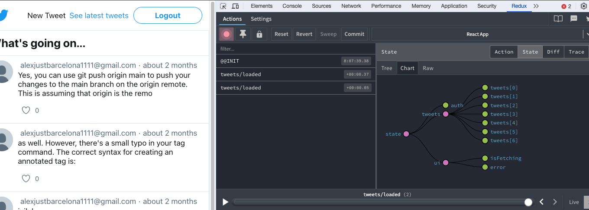

---

Ya puedes ver el `ui` 

Vamos a llevar la logica al compomponente de 

`LoginPage.js`

  `const [error, setError] = useState(null);`  
  `const [isFetching, setIsFeching] = useState(false);`  

Esto lo quitas porque lo puedes sacar de Redux. Simplemente te creas un `selector.js`

```js
export const getUi = state => state.ui;
```

Y le pasas este objeto 

  `ui: {`  
    `isFetching: false,`  
    `error: null,`  
  `},`  
  
```js
function LoginPage() {
  const dispatch = useDispatch();
  const { isFetching, error } = useSelector(getUi);
```

Ahora lo que tenías localmente ya lo traes de fuera. Seguimos cambiando las acciones con dispatch
Esto no hace falta

  `const onLogin = () => {`  
    `dispatch(authLoginSuccess());`  
  `};`  


```js

import {
  authLoginFailure,
  authLoginRequest,
  authLoginSuccess,
  uiResetError
} from '../../../store/actions';
import { getUi } from '../../../store/selector';


function LoginPage() {
  const dispatch = useDispatch();
  const { isFetching, error } = useSelector(getUi);

  const [credentials, setCredentials] = useState({
    username: '',
    password: '',
  });
  const location = useLocation();
  const navigate = useNavigate();

  const handleSubmit = async event => {
    event.preventDefault();

    try {
      //setIsFeching(true);
      dispatch(authLoginRequest());
      await login(credentials);
      //setIsFeching(false);
      //onLogin();
      dispatch(authLoginSuccess()); // esto hace las dos cosas
      const to = location?.state?.from?.pathname || '/';
      navigate(to);
    } catch (error) {
      // setIsFeching(false);
      // setError(error);
      dispatch(authLoginFailure(error));
    }
  };

  const resetError = () => {
    dispatch(uiResetError());
  };

```

---
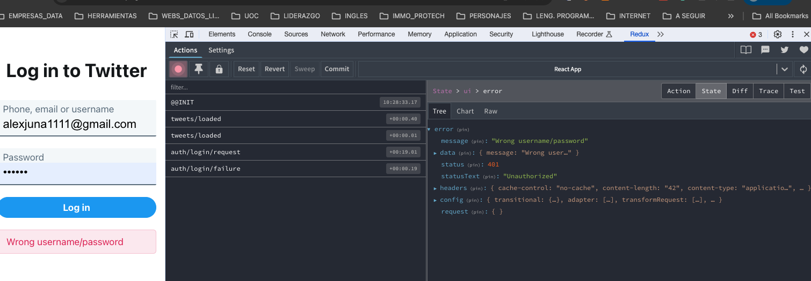

---

Hemos metido el error en el strore de redux y el componenete como esta conectado ha esta parte de store lo teemos pindado. Y si clicas en el mensaje de error pondrás el error a nulo.

Esto es una  priera aproximacon hacer acciones asincronas en redux.
* comienzas la llamada
* llamas al servicio externo y has de esperar la respuesta /promesa
* al final cada punto lo podemos asociar a acciones sincronas que podemos cambiar


**Refactoring** 

Podemos mejorar el `reducer.js` refactorizando con alguna expresino regular 

```js
import {
  AUTH_LOGIN_REQUEST,
  AUTH_LOGIN_SUCCESS,
  AUTH_LOGOUT,
  TWEETS_CREATED,
  TWEETS_LOADED,
  UI_RESET_ERROR,
} from './types';

const defaultState = {
  auth: false,
  tweets: [],
  ui: {
    isFetching: false,
    error: null,
  },
};

export function auth(state = defaultState.auth, action) {
  switch (action.type) {
    case AUTH_LOGIN_SUCCESS:
      return true;
    case AUTH_LOGOUT:
      return false;
    default:
      return state;
  }
}

export function tweets(state = defaultState.tweets, action) {
  switch (action.type) {
    case TWEETS_LOADED:
      return action.payload;
    case TWEETS_CREATED:
    default:
      return state;
  }
}

export function ui(state = defaultState.ui, action) {
  if (action.error) {
    return { isFetching: false, error: action.payload };
  }
  if (action.type.endsWith('/request')) {
    return { isFetching: true, error: null };
  }
  if (action.type.endsWith('/success')) {
    return { isFetching: false, error: null };
  }
  if (action.type === UI_RESET_ERROR) {
    return { ...state, error: null };
  }

  return state;
}
```

**Refactoring** 

Somos nosotros lo que tiene que ver con el flujo, despacho acciones, llamo al sercio, esperar, etc 

`loginPage.js`

```js
    try {
      dispatch(authLoginRequest()); // despacho acciones
      await login(credentials); // llamo al sercio
      dispatch(authLoginSuccess()); // etc
      const to = location?.state?.from?.pathname || '/';
      navigate(to);
    } catch (error) {
      dispatch(authLoginFailure(error));
    }
``` 

estaría bien si al `loginPage` le paso una **accion** que implique todo este flujo, lo unico tenga que hacer es despachar una accion y que por debajo se hiciera todo lo demás. Pero con Reudx de momento henos visto que se pueden hacer acciones sincronas y no asincronas, pero podemos hacer identificar los puntos donde meter estas acciones sincronas, lo unico que podemos despachar son oobjetos, pero si le damos al vuelta pude ser ampliado con un sistea de middelware para pasar funciones. Nos interponemos entre el momento que se despacha la accion y el momento en que llega la accion.

---
> [!NOTE]
> Acciones Asíncronas con **Reudx Thunk Middleware**  
> Léete los slides de Reudx Thunk Middleware
---

```sh
npm i redux-thunk
```

le decimos al gestor de reduc que vamos a utilizar este middleware

`store/index.js`

```js
import { createStore, combineReducers, applyMiddleware } from 'redux';
// import { thunk } from 'redux-thunk';
import { composeWithDevTools } from '@redux-devtools/extension';

import * as reducers from './reducers';
import * as actionCreators from './actions';

const composeEnhancers = composeWithDevTools({ actionCreators });
const thunk = store => next => action => {
  if (typeof action === 'function') {
    return action(store.dispatch, store.getState);
  }
  next(action);
};

const middleware = [thunk];

export default function configureStore(preloadedState) {
  const store = createStore(
    combineReducers(reducers),
    preloadedState,
    composeEnhancers(applyMiddleware(...middleware)),
  );
  return store;
}
```

Me creo una accion creator que siempre devielven objetos, pero *Reudx Thunk Middleware nos permite que devuelve una nueva function

`action.js`

La funcion interna `return async function (dispatch, getState) { //` es lo que va a interceptar el miidleware y esta le dará el dispatch 

```js
export function authLogin(credentials) {
  return async function (dispatch, getState) { //

}
```

Ahora teniedo lo de arriba podría meter todo esto del `loginPage.js` que hablábamos

```js
export function authLogin(credentials) {
  return async function (dispatch, getState) {
    try {
      dispatch(authLoginRequest());
      await login(credentials);
      dispatch(authLoginSuccess());
    } catch (error) {
      dispatch(authLoginFailure(error));
      throw error;
    }
  };
}
```
y `loginPage.js` quedaría así

```js
    try {
      await dispatch(authLogin(credentials));
      const to = location?.state?.from?.pathname || '/';
      navigate(to);
    } catch (error) {
      console.log(error);
    }
  };
```

Me he llevado el flujo al `action.js / authLogin(credentials)`.

En definitiva :

https://redux.js.org/understanding/history-and-design/middleware#understanding-middleware 

Sin middleware -> flujo sincrono  
Con middleware -> flujo asíncrono  
* Cada middleware envuelve a dispatch e intercepta la acción
* Podemos emitir cosas distintas a acciones síncronas(funciones, promesas, …)
* Podemos acceder al estado dentro del middleware
* Cada middleware puede pasar acciones al siguientemiddleware
* El último middleware envuelve al dispatch original de Redux, por lo que debe asegurarse que las acciones que le pase son acciones normales de Redux (objetos con type)

---
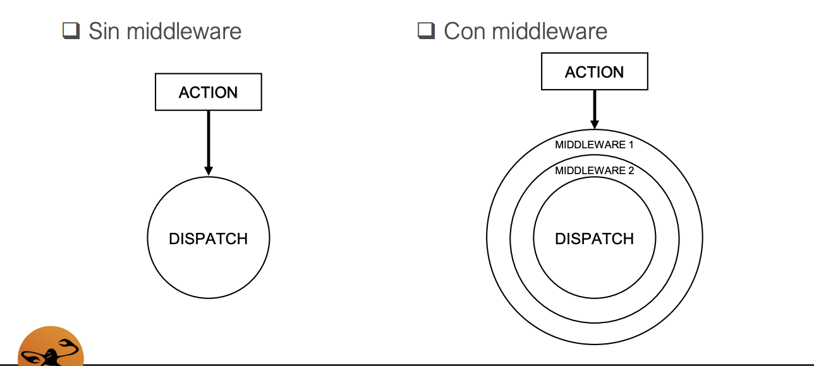

---

**Middelware Loger**

Vamos hacer que tengamos la psoibilidad de loguear cada accion y el resultado posterior. Podemos crearnos un Middleware para ello. 

`store/ìndex.js` 

```js
// logger recibe el store que recibe una función "next" que esta recibe otra funcion "action"
const logger = store => next => action => {
};
```

Cuando llames a dispatch en realidad llamarás a esta rama. 

```js
const logger = store => next => action => {
  console.group(action.type);  // Inicia grupo en consola, agrupa mens siguientes bajo título común.
  console.info('dispatching', action, store.getState()); // info consola acción despachando y estado
  const result = next(action); // // Llama al siguiente middleware
  console.log('final state', store.getState()); // consola el estado final después acción procesada.
  console.groupEnd(); // // Cierra el grupo iniciado anteriormente en la consola.
  return result;
};


// Ahora esto hay que meterlo en el middleware. El orden del arrray importa y puede fallar, 
const middleware = [thunk, logger];
```
Fíjate como nos llega la informacino

---
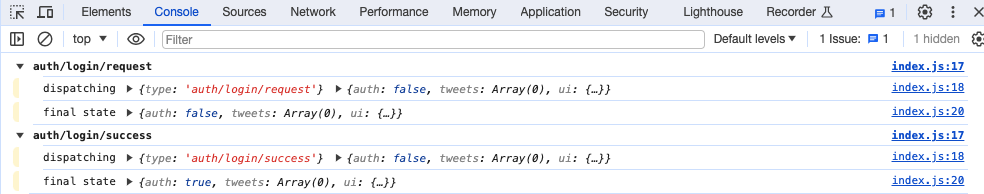

---

**auth/login/request** aquí empieza el login request, al meterlo al final del array `const middleware = [thunk, logger];` por conslo ya solo pinta las acciones que tiene un request , las que sion funciones las está tratantp Thunk y las está ejecutanto. Y Al final pinta el estado final **auth/login/success**

Es decir, con una función pequeña somos capaces de loggear cualquier dispatch de toda la aplicacón, no tengo que ir al componente a buscar el dispatch y hacer un console.log delante y un console.log detrás para saber que está ocurriendo... no, me creo un Middelware y ahí lo tengo.

**Middelware noAction**

Ejemplo chorra de lo que podemos hacer

```js
const noAction = () => next => action => {
  // Verifica si el tipo de acción termina con '/no-throw'.
  if (action.type.endsWith('/request)) {
    // Si es así, no hace nada más y no pasa la acción al siguiente middleware o reducer.
    // Esto efectivamente "traga" o ignora las acciones que terminan con '/no-throw'.
    return;
  }
  // Si el tipo de acción no termina con '/no-throw', pasa la acción al siguiente
  // middleware o reducer en la cadena de Redux.
  return next(action);
};


const middleware = [thunk, logger, noAction];
```
---


---

Fíjate que ahora no ha lanzado la accion de request. Imagina que no quieres que se lancen algún tipo de accoin.

**Middelware timestamp** 

Paea llevar el control de cada hora que se lanza **cada acción**.

```js
const timestamp = () => next => action => {
  return next({
    ...action,
    meta: { ...action.meta, timestamp: new Date() },
  });
};

const middleware = [thunk, timestamp, logger, noAction];
```

Cada acción detrás del `timestap` se ejecutará el middelware. Con esto te aseguras que todas las acciones, todas, llevan la hora. 

Fíjate qué lleva cada acción ahora.

---
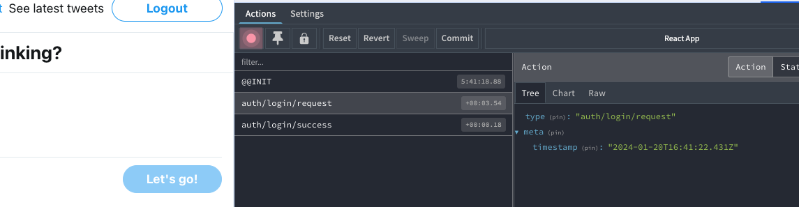

---

Y no te has de preocupar que cada una lleve un tiempo. En el artúculo tienes muchos ejemplos

* https://redux.js.org/understanding/history-and-design/middleware#understanding-middleware 


### Utilidad del getState [commit : Load tweets thunk]

Utilidad del getState : Tener acceso al estado dentro de una acción.

`types.js` 

```js
export const TWEETS_LOADED_REQUEST = 'tweets/loaded/request';
export const TWEETS_LOADED_SUCCESS = 'tweets/loaded/success';
export const TWEETS_LOADED_FAILURE = 'tweets/loaded/failure';
```

`actions.js`

```js
export const tweetsLoadedRequest = () => ({
  type: TWEETS_LOADED_REQUEST,
});

export const tweetsLoadedSuccess = tweets => ({
  type: TWEETS_LOADED_SUCCESS,
  payload: tweets,
});

export const tweetsLoadedFailure = error => ({
  type: TWEETS_LOADED_FAILURE,
  error: true,
  payload: error,
});

// FLUJO DE CARGA DE tweets
export function loadTweets() {
    try {
      dispatch(tweetsLoadedRequest());
      const tweets = await getLatestTweets();
      dispatch(tweetsLoadedSuccess(tweets));
    } catch (error) {
      dispatch(tweetsLoadedFailure(error));
      throw error;
    }
  };
}
```

`reducers.js`

```js
import {AUTH_LOGIN_SUCCESS,AUTH_LOGOUT,TWEETS_CREATED, TWEETS_LOADED_SUCCESS,UI_RESET_ERROR,
} from './types';

const defaultState = {
  auth: false,
  tweets: [],
  ui: {
    isFetching: false,
    error: null,
  },
};

export function tweets(state = defaultState.tweets, action) {
  switch (action.type) {
    // case TWEETS_LOADED:
    case TWEETS_LOADED_SUCCESS:
      return action.payload ;

    case TWEETS_CREATED:
    default:
      return state;
  }
}
```

Fíajte que tieniedo aquí esta informacion `tweets: [],` que es un array, yo lo que quiero saber es si se han cargado los tweets o no. Si el array está vacío yo no se si ya se ha llamado al api o no. Voy a refactorizar para indicar queya se han cargado y la data de la carga. Si no es asñi nunca sabría si yaa se llamo al api, esto es bueno par que no repitamos las llamadas.:

```js
const defaultState = {
  auth: false,
  tweets: {
    areLoaded: false,
    data: [],
  },
  ui: {
    isFetching: false,
    error: null,
  },
};


export function tweets(state = defaultState.tweets, action) {
  switch (action.type) {
    case TWEETS_LOADED_SUCCESS:
      return { areLoaded: true, data: action.payload }; // cambio esto tbn

    case TWEETS_CREATED:
    default:
      return state;
  }
}
```

Ahora en el componente 

`tweetsPage.js`  

```js
// ANTES
function TweetsPage() {
  const tweets = useSelector(getTweets);
  const dispatch = useDispatch();

  useEffect(() => {
    getLatestTweets().then(tweets => {
      dispatch(tweetsLoaded(tweets));
    });
  }, [dispatch]);

// DESPUES
function TweetsPage() {
  const tweets = useSelector(getTweets); // ... y se conecta para mostarlo
  const dispatch = useDispatch();

  useEffect(() => {
    dispatch(loadTweets()); // Despacha la accion de carga de tweets y ...
  }, [dispatch]);
  ...
```

el problema ahora es que el selector `useSelector(getTweets)` que es `getTweets` está apuntando a `state.tweets` en 

`selectors.js`

```js
// ANTES
export const getTweets = state => state.tweets;

//DESPUES
export const getTweets = state => state.tweets.data;
```
> [!TIP]
>  En el mismo selector, quiero que si ya se han crgado los tweets no se vuelvan a cargar

```js
export const areTweetsLoaded = state => state.tweets.areLoaded;
```
Le meto un condicional a la accion si pasándole el state de `getState` preguntamos si están cargados

`actions.js` 

```js
export function loadTweets() {
  return async function (dispatch, getState) {
    if (areTweetsLoaded(getState())) {
      return;
    }

    try {
      dispatch(tweetsLoadedRequest());
      const tweets = await getLatestTweets();
      dispatch(tweetsLoadedSuccess(tweets));
    } catch (error) {
      dispatch(tweetsLoadedFailure(error));
      throw error;
    }
  };
}
```

Fíjate que me permite dentro de las acciones tener acceso al valor del estado, es decir, puedo meter lógica en funcion de lo que quiera.

**lo mismo con el detalla de cada tweet**

El detalla de Tweet tiene que tener una acción similar, es decir, tengo una acción de cargar mi detalle... pero si mi detalle ya está en redux no lo cargo y lo cojo directamente 

es un mecanismo para controlar cuando quiero caché y cuando no.

--- 
> [!NOTE] 
> Date cuenta que podemos cambiar la forma del estado sin miedo porque lo controlamos todo en los selectores y podemos controlar las acciones hasta el más mínimo detalle (quiero volver a la zando la accion, o quiero descartarla, etc) Dejando al componente adnóstico, el componente tira la acción sin saber más.
--- 

Nuestro fichero de `actions.js` tiene unas dependencias externas de servicio

```js
import { login } from '../pages/auth/service';
import { getLatestTweets } from '../pages/tweets/service';
```

Redu nos deja desde con inyectamos el Thun hacer llgar a nuestras acciones un 3er parámetro para meter lo que nos de la gana `return async function (dispatch, getState, ... })`

`actions.js`

en este argumento nuevo ...

```js
export function authLogin(credentials) {
  return async function (dispatch, getState, ... }) // ... aquí le puedo pasar todas mis acciones
```
¿porqué no inyectar aquí la llamada al api y asi nos quitamos la dependencias al service?

ExtraArgument

`ìndex.js`

```js
const thunk = store => next => action => {
  if (typeof action === 'function') {
    return action(store.dispatch, store.getState, ExtraArgument); // aquí le puedo pasar todas mis acciones
  }
  next(action);
};
```

con este ExtraArgument voy a llegar a todas mis acciones `(dispatch, getState, { api: { auth } })`

```js
export function authLogin(credentials) {
  return async function (dispatch, getState, { api: { auth } }) {
    try {
      dispatch(authLoginRequest());
      await auth.login(credentials); // añado auth
      dispatch(authLoginSuccess());
    } catch (error) {
      dispatch(authLoginFailure(error));
      throw error;
    }
  };
}
```

La idea es que desde fuera le inyecto esto `{ api: { auth } }`

De la misma forma para cargar los tweets me va a inyectar `{ api: { tweets } }`

```js
export function loadTweets() {
  return async function (dispatch, getState, { api: { tweets } }) {
    if (areTweetsLoaded(getState())) {
      return;
    }

    try {
      dispatch(tweetsLoadedRequest());
      const tweetsList = await tweets.getLatestTweets(); // añado tweets.
      dispatch(tweetsLoadedSuccess(tweetsList));
    } catch (error) {
      dispatch(tweetsLoadedFailure(error));
      throw error;
    }
  };
}
``` 

Para inyectar todo esto 

`ìndex.js`

```js
import * as tweets from '../pages/tweets/service';
import * as auth from '../pages/auth/service';


const thunk = extraArgument => store => next => action => {
  if (typeof action === 'function') {
    return action(store.dispatch, store.getState, extraArgument);
  }
  next(action);
};


// const middleware = [thunk, timestamp, logger, noAction];
// DESPUES
const middleware = [
  withExtraArgument({ api: { auth, tweets } }),
  timestamp,
  logger,
  noAction,
];
``` 

Acabas de envovler otra funcion por fuera y ahí le pasas loque sea.


**OJO**

Pero ahora Thunk ha creado una funcion para inyectar codigo  
`import { thunk, withExtraArgument } from 'redux-thunk';`

```js
import { createStore, combineReducers, applyMiddleware } from 'redux';
import { thunk, withExtraArgument } from 'redux-thunk';
import { composeWithDevTools } from '@redux-devtools/extension';

import * as reducers from './reducers';
import * as actionCreators from './actions';

import * as tweets from '../pages/tweets/service';
import * as auth from '../pages/auth/service';

const composeEnhancers = composeWithDevTools({ actionCreators });

// const thunk = extraArgument => store => next => action => {
//   if (typeof action === 'function') {
//     return action(store.dispatch, store.getState, extraArgument);
//   }
//   next(action);
// };

const logger = store => next => action => {
  console.group(action.type);
  console.info('dispatching', action, store.getState());
  const result = next(action);
  console.log('final state', store.getState());
  console.groupEnd();
  return result;
};

const noAction = () => next => action => {
  if (action.type.endsWith('/no-throw')) {
    return;
  }
  return next(action);
};

const timestamp = () => next => action => {
  return next({
    ...action,
    meta: { ...action.meta, timestamp: new Date() },
  });
};

const middleware = [
  withExtraArgument({ api: { auth, tweets } }),
  timestamp,
  logger,
  noAction,
];

export default function configureStore(preloadedState) {
  const store = createStore(
    combineReducers(reducers),
    preloadedState,
    composeEnhancers(applyMiddleware(...middleware)),
    // window.__REDUX_DEVTOOLS_EXTENSION__ &&
    //   window.__REDUX_DEVTOOLS_EXTENSION__(),
  );
  return store;
}
```

TENEMOS las dos opciones


**Inyectamos el navegate de Route**


1. poder inyectar no solo el api, sino dentro del objeto inyectar el `Router` para en las acciones despues de las respuestas del api se pueda navegar a l pagina que quiera.

`store/index.js`

le meto dentro el middelware

```js
export default function configureStore(preloadedState, { router }) {
  const middleware = [
    withExtraArgument({ api: { auth, tweets }, router }),
    timestamp,
    logger,
    noAction,
  ];
  const store = createStore(
    combineReducers(reducers),
    preloadedState,
    composeEnhancers(applyMiddleware(...middleware)),
    // window.__REDUX_DEVTOOLS_EXTENSION__ &&
    //   window.__REDUX_DEVTOOLS_EXTENSION__(),
  );
  return store;
}
```

`actions.js`

```js
// ANTES
export function authLogin(credentials) {
  return async function (dispatch, getState, { api: { auth } }) {
    try {
      dispatch(authLoginRequest());
      await auth.login(credentials);
      dispatch(authLoginSuccess());
    } catch (error) {
      dispatch(authLoginFailure(error));
      throw error;
    }
  };
}
// DESPUES
export function authLogin(credentials) {
  return async function (dispatch, getState, { api: { auth }, router }) {
    try {
      dispatch(authLoginRequest());
      await auth.login(credentials);
      dispatch(authLoginSuccess());
      const to = router.state.location.state?.from?.pathname || '/'; // <-----
      router.navigate(to); // <-----
    } catch (error) {
      dispatch(authLoginFailure(error));
      throw error;
    }
  };
}
```

todo esto que he añadido aquí básicamente es lo que viene en el `loginPage/handleSubmit`

```js
    try {
      await dispatch(authLogin(credentials));
      const to = location?.state?.from?.pathname || '/';
      navigate(to);
    } catch (error) {
      console.log(error);
    }
  };
```

Quitamos cosas `loginPage`

```js
//ANTES
function LoginPage() {
  const dispatch = useDispatch();
  const { isFetching, error } = useSelector(getUi);

  const [credentials, setCredentials] = useState({
    username: '',
    password: '',
  });
  const location = useLocation();
  const navigate = useNavigate();

  const handleSubmit = async event => {
    event.preventDefault();

    try {
      await dispatch(authLogin(credentials));
      const to = location?.state?.from?.pathname || '/';
      navigate(to);
    } catch (error) {
      console.log(error);
    }
  };

// DESPUES
function LoginPage() {
  const dispatch = useDispatch();
  const { isFetching, error } = useSelector(getUi);

  const [credentials, setCredentials] = useState({
    username: '',
    password: '',
  });

  const handleSubmit = event => {
    event.preventDefault();
    dispatch(authLogin(credentials));
  };
``` 

Ahora mismo el sumit simplemente es un dispatch, el  mismoc odigo se lo inyecto por el Router `router.state.location.state?.from?.pathname || '/';`


**¿Qué falta cambiar?**

`Root`

esto que estamos usando `<BrowserRouter>` viene con un BrowserRouter ya configurado. Sin enbargo puedo utilizar otro componente `RouterProvider` que acepta un objeto router

La idea es que el mismo objeto router que yo voy a inyectar a las acciones va a ser el que va a manejar 
la navegación de mi aplicacion. El anterior compnente no me permití ahacerlo y yo quiero crearme mi propio objeto router y pasarlo.

Para ello me voy a `Index` y me creo un Router

`scr/Index`

```js
import { createBrowserRouter } from 'react-router-dom';

const router = createBrowserRouter([{ path: '*', element: <App /> }]);

const store = configureStore({ auth: !!accessToken }, { router }); // se lo paso por aquí

//ANTES
root.render(
  <React.StrictMode>
    <ErrorBoundary>
      <Root store={store} router={router} >
          <App />
      </Root>
    </ErrorBoundary>
  </React.StrictMode>,
);
//DESPUES
root.render(
  <React.StrictMode>
    <ErrorBoundary>
      <Root store={store} router={router} />
    </ErrorBoundary>
  </React.StrictMode>,
);
```
Fíjate que como la le hemos pasado el `element: <App />` no podemos repetirlo en `root.render(`

---

cualquier ruta que la enrute al elemento `<App />` y esta ruta se la he pasado al  
`<Root store={store} router={router} />`

por lo tanto nos vamos a meter en `Root`

```js
export default function Root({ store, router }) {
  return (
    <Provider store={store}>
      <Router router={router} />
    </Provider>
  );
```

como se lo he pasado por aquí `store = configureStore({ auth: !!accessToken }, { router });`

a través de `configureStore(` llegará al `store/index/ExtraArgument` que me va a llevar a las acciones

```js
export default function configureStore(preloadedState, { router }) {
  const middleware = [
    withExtraArgument({ api: { auth, tweets }, router }),
    timestamp,
    logger,
    noAction,
  ];
```

Inyectando el router hemos dejado el componete loginPage muy sencillo, solo se dedica a cojer las credenciales y despacharlas. T

```js
  const handleSubmit = event => {
    event.preventDefault();
    dispatch(authLogin(credentials));
  };
```

todo el flujo lo hce Redux de una forma centralizada en acciones `actions`

```js
export function authLogin(credentials) {
  return async function (dispatch, getState, { api: { auth }, router }) {
    try {
      dispatch(authLoginRequest());
      await auth.login(credentials);
      dispatch(authLoginSuccess());
      const to = router.state.location.state?.from?.pathname || '/';
      router.navigate(to);
    } catch (error) {
      dispatch(authLoginFailure(error));
      throw error;
    }
  };
}
```

es como barrer la casa y dejarlo todo por debajo.
hemos de dejar que los compnente pinten cosas en pantalla todo lo demás por debajo.

Profiero inyectar a hacer un `import` 
* es más facil
* menos dependencias
* mejor para el test
* mejor para refactor
  
esta es la idea de centralizar

**Detalle del Tweet**

Ahora mismo si cargamos la página de los tweets y clicamos el detalle podemos ver como redux ha almacenado toda la informacion de todos los twwets

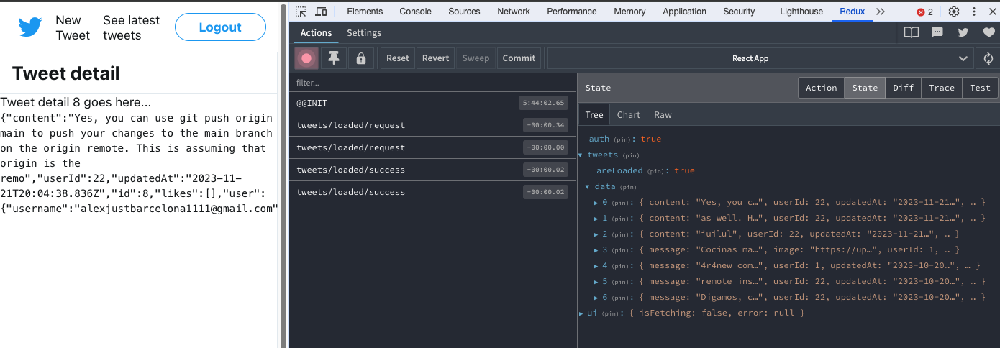

pero si recargamos la página vemos también como se han borrado, como estamos perdiendo todo el estado de memoria no inta nada.

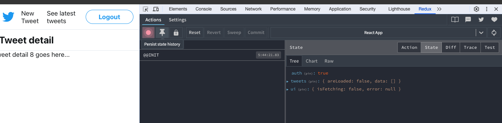


Se me ocuure que podríamos tener una acción para cargar el detalle y que esa acción fuese capaz de manegar desde el detalle que carga un único tweet , esa acción llamarla siempre desde el componente detalle y luego internamente en la acción podemos afinar y decir que si ya lo tiene cargado le puedo ahorrar esa petición y si no lo tengo cargado voy hacer la petición y voy a tener una acción y un reducer que permita meter al menos ese twwet en el estado.

`types.js`

```js
export const TWEETS_DETAIL_REQUEST = 'tweets/detail/request';
export const TWEETS_DETAIL_SUCCESS = 'tweets/detail/success';
export const TWEETS_DETAIL_FAILURE = 'tweets/detail/failure';
```

`actions`

```js
// creamos las tres acciones
export const tweetsDetailRequest = () => ({
  type: TWEETS_DETAIL_REQUEST,
});

export const tweetsDetailSuccess = tweet => ({
  type: TWEETS_DETAIL_SUCCESS,
  payload: tweet,
});

export const tweetsDetailFailure = error => ({
  type: TWEETS_DETAIL_FAILURE,
  error: true,
  payload: error,
});

export function detailTweets(tweetId) {
}
```

Antes de ponernos a manejar la accion asincrona de thunk lo que haremos será darle cobertura  a estas tres tipos a estas tres acciones en nuetro reducer

`reducer`

lo que haré será integrarlo en `tweets` e `ui` sería igual


```js
export function tweets(state = defaultState.tweets, action) {
  switch (action.type) {
    case TWEETS_LOADED_SUCCESS:
      return { areLoaded: true, data: action.payload };

    case TWEETS_DETAIL_SUCCESS:
      return { areLoaded: false, data: [action.payload] };
    // return { ...state, data: [...state.data, action.payload] };

    case TWEETS_CREATED:
    default:
      return state;
  }
}
```

Ahora falta manejar la acción completa del Thun

`action.js`

```js
export const tweetsDetailRequest = () => ({
  type: TWEETS_DETAIL_REQUEST,
});

export const tweetsDetailSuccess = tweet => ({
  type: TWEETS_DETAIL_SUCCESS,
  payload: tweet,
});

export const tweetsDetailFailure = error => ({
  type: TWEETS_DETAIL_FAILURE,
  error: true,
  payload: error,
});

export function detailTweets(tweetId) {
  return async function (dispatch, getState, { api: { tweets } }) {
    // con el selector: si el tweet existe... no hagas nada
    if (getTweet(tweetId)(getState())) {
      return;
    }

    try {
      dispatch(tweetsDetailRequest());
      const tweet = await tweets.getTweet(tweetId);
      dispatch(tweetsDetailSuccess(tweet));
    } catch (error) {
      dispatch(tweetsDetailFailure(error));
      throw error;
    }
  };
}
```

Recuerda que desde TweetPage tenemos acceso a la url `const params = useParams();` y como tenemos este acceso en la accion que pide este compnente para crgar su propio twwet  `useSelector(getTweet(params.tweetId));` vamos a tener el `params.tweetId` es decir tendremos el id del tweet y es por eso que la accion anterior tendrá el atributo `export function detailTweets(tweetId) {`

Para disparar la acció necesitamos un `useEffect(()` en 

`TweetPage`

```js
// ANTES 
function TweetPage() {
  const params = useParams();
  const tweet = useSelector(getTweet(params.tweetId));

  return (
    <Content title="Tweet detail">
      <div>
        Tweet detail {params.tweetId} goes here...
        {tweet && (
          <div>
            <code>{JSON.stringify(tweet)}</code>
          </div>
        )}
      </div>
    </Content>
  );
}

export default TweetPage;

// DESPUES
function TweetPage() {
  const params = useParams();
  const tweet = useSelector(getTweet(params.tweetId));

  const dispatch = useDispatch();

  useEffect(() => {
    dispatch(detailTweets(params.tweetId));
  }, [dispatch, params.tweetId]);

  return (
    <Content title="Tweet detail">
      <div>
        Tweet detail {params.tweetId} goes here...
        {tweet && (
          <div>
            <code>{JSON.stringify(tweet)}</code>
          </div>
        )}
      </div>
    </Content>
  );
}

export default TweetPage;
```

Fíjate que cuando el usuario haga una recarga de la página, el selector va a intentar traerse info pero no va a traer nada `const tweet = useSelector(getTweet(params.tweetId));` y esto no pintará nada   
`TweetPage`  

```js
        {tweet && (
          <div>
            <code>{JSON.stringify(tweet)}</code>
          </div>
        )}
 ```

pero después del primer render el componente va a tirar la acción  
`TweetPage`  

```js
  useEffect(() => {
    dispatch(detailTweets(params.tweetId));
  }, [dispatch, params.tweetId]);
```

como en este caso todavía no tenemos la información en el `store` de ese tweet

`action.js`

```js 
// action
    if (getTweet(tweetId)(getState())) {
      return;
    }
```

pues se despacha todo el flujo que le sigue

```js
  return async function (dispatch, getState, { api: { tweets } }) {
    if (getTweet(tweetId)(getState())) {
      return;
    }

    try {
      dispatch(tweetsDetailRequest());
      const tweet = await tweets.getTweet(tweetId);
      dispatch(tweetsDetailSuccess(tweet));
    } catch (error) {
      dispatch(tweetsDetailFailure(error));
      throw error;
    }
  };
```

el `tweetsDetailSuccess(tweet)` nos llama  a esta acción `type: TWEETS_DETAIL_SUCCESS,` y llegamos al 

`reducer.js` 

```js
export function tweets{...
    ...
    case TWEETS_DETAIL_SUCCESS:
      return { areLoaded: false, data: [action.payload] };
    ...
```
lo introduce en data.

A continuacion este componente `TweetPage() ` como tiene un selector `const tweet = useSelector(getTweet(params.tweetId)); ` nos llegará los datos que se le acaban de introducir y se pintará. Todo esto si la carga es desde la URL.

Si venidos del listado la lo tendremos pintado de primeras y esto no hace nada

```js 
// action
    if (getTweet(tweetId)(getState())) {
      return;
    }
```

Si haces la recarga ya te funciona

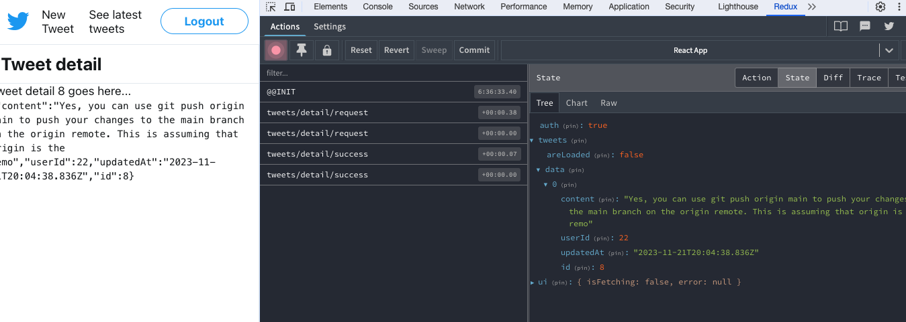

Además puedes ver que está haciendo la petición, está llamando a `http://localhost:3000/tweets/8`

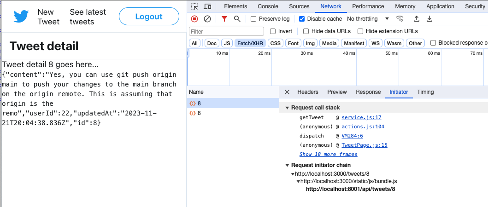


--- 

Ahora tienes que traerte `?_expand=user&_embed=likes` al `export const getTweet = tweetId => {` en 

`/tweets/service.js`

```js
import client from '../../api/client';


const tweetsUrl = '/api/tweets';

export const getLatestTweets = () => {
  const url = `${tweetsUrl}?_expand=user&_embed=likes&_sort=updatedAt&_order=desc`;
  return client.get(url);
};

export const createTweet = tweet => {
  const url = tweetsUrl;
  return client.post(url, tweet);
};

export const getTweet = tweetId => {
  const url = `${tweetsUrl}/${tweetId}?_expand=user&_embed=likes`;
  return client.get(url);
};
```

**Creando un Tweet**

Tipo accion `created`

`type.js`

```js
export const TWEETS_CREATED_REQUEST = 'tweets/created/request';
export const TWEETS_CREATED_SUCCESS = 'tweets/created/success';
export const TWEETS_CREATED_FAILURE = 'tweets/created/failure';
```

Creando el caso de la accion `case TWEETS_CREATED_SUCCESS:`

`reducer.js`

```js
export function tweets(state = defaultState.tweets, action) {
  switch (action.type) {
    case TWEETS_LOADED_SUCCESS:
      return { areLoaded: true, data: action.payload };

    case TWEETS_DETAIL_SUCCESS:
      // return { ...state, data: [...state.data, action.payload] };
      return { areLoaded: false, data: [action.payload] };

    case TWEETS_CREATED_SUCCESS:
      return { ...state, data: [action.payload, ...state.data] };

    default:
      return state;
  }
}
```

`action.js`

```js
export const tweetsCreatedRequest = () => ({
  type: TWEETS_CREATED_REQUEST,
});

export const tweetsCreatedSuccess = tweet => ({
  type: TWEETS_CREATED_SUCCESS,
  payload: tweet,
});

export const tweetsCreatedFailure = error => ({
  type: TWEETS_CREATED_FAILURE,
  error: true,
  payload: error,
});

export function createTweet(tweet) { // estamos enviado un objeto tweet <-------------
  return async function (dispatch, _getState, { api: { tweets }, router }) {
    try {
      dispatch(tweetsCreatedRequest());
      const { id } = await tweets.createTweet(tweet);
      const createdTweet = await tweets.getTweet(id);
      dispatch(tweetsCreatedSuccess(createdTweet));
      router.navigate(`/tweets/${createdTweet.id}`);
    } catch (error) {
      dispatch(tweetsCreatedFailure(error));
      throw error;
    }
  };
}
```

`createTweet(tweet)` estamos enviado un objeto tweet <-------------

cuando hacemos `NewTweetPage.js` estamos enviando el content:

```js
  const handleSubmit = event => {
    event.preventDefault();
    onSubmit(content);
  };
```
y este `onSubmit(content);` llama a `createTweet({ content })`

```js
  const handleSubmit = async content => {
    dispatch(createTweet({ content }));
  };
``` 
entonces al api es pasarle un objeto con todo el tweet. Este mismo objeto será lo que le voy a pasar a la acción porque luego la acción se la va a pasar al servicio. 
en `service` le pasabamos un ` tweet => {` con el metodo createTweet

```js
export const createTweet = tweet => {
  const url = tweetsUrl;
  return client.post(url, tweet);
};
```
y en `action` le paso el tweet `const { id } = await tweets.createTweet(tweet);` 

```js
    try {
      dispatch(tweetsDetailRequest());
      const tweet = await tweets.getTweet(tweetId);
```
--- 

Ahora el componente tiene que hacer el dispatc y el effect

`NewTweetPage.js`

```js
function NewTweetPage() {
  const dispatch = useDispatch();
  const { isFetching } = useSelector(getUi); // esto cambiará nuestra acción
```

fíjate que voy a leminar todo esto porque los errores los manejare fuera

```js
// ANTES
  const handleSubmit = async content => {
    try {
      setIsFetching(true);
      const tweet = await createTweet({ content });
      navigate(`../${tweet.id}`, { relative: 'path' });
    } catch (error) {
      if (error.status === 401) {
        navigate('/login');
      } else {
        setIsFetching(false);
        // Show errorMemoHeavyComponent
      }
    }
  };

// DESPUES
  const handleSubmit = async content => {
    dispatch(createTweet({ content }));
  };

```

> [!NOTE] 
> Lo importante es saber en qué puntos podemos llamar a  la accion, dentro de la acción identificar los puntos request, error o success, y a continuación de eso tratar las acciones correctamente en los reducer.

**LogOut** 

> ![NOTE]  
> Hazlo tu, es la única llamada al servicio  
> 1:30h hazlo para la práctica  
> La idea es que es que los componentes, si veo algún importe en un componente de una llamada a un servicio, ella es un punto de uy aquí esto se está manejando localmente.El componente debería hablar con redes. Si yo tengo el flujo metido en reus pues el componente debería hablar con redes, le vamos a quitar a componente que él se tenga que encargar de hacer más de una cosa Eso sería la idea llamar al servicio, llamar a la acción, etcétera.No llamas a la acción de Redus y la acción de reduce por debajo que haga todo lo que tiene que hacer.De hecho, yo creo que la única llamada al servicio que nos queda pendiente de sacar sería esta, en este caso.Yo creo que ya no hay ninguna más Si Si la hubiera, tendría que haber imports por aquí, veis que no los tenemos.Lo único que tenemos es el nogado. Entonces ya sacáis esta ya lo dejáis limpio y el único sitio donde estaríamos.Teniendo las llamadas a nuestro servicio, sería aquí en la creación de la creación del estado del Store, porque a partir de aquí recordad que la estábamos inyectando con el extra argumen del turco.Luego tenemos todas las dependencias de mi App. Las tengo bastante bastante localizadas, centralizadas


**Errores** 

commit : Failure redirect middleware


Hay errores bastante repetitivos 401 o 404

Me creo un Middelware

`store/index.js`

```js
const failureRedirects = (router, redirectsMap) => store => next => action => {
  // ejecuta la acción
  const result = next(action);

  if (action.error) {
    // según el status 401/404
    const redirect = redirectsMap[action.payload.status];
    if (redirect) {
      router.navigate(redirect);
    }
  }

  return result;
};

export default function configureStore(preloadedState, { router }) {
  const middleware = [
    withExtraArgument({ api: { auth, tweets }, router }),
    timestamp,
    failureRedirects(router, { 401: '/login', 404: '/404' }), // <------ se la paso: failureRedirects()
    logger,
    noAction,
  ];
```

---

## useReducer


Es una alternativa tipo Reduc a useState, preferible cuando tenemos lógica de estado complicada. Es más potente y nos da unas ventajas que no nos da useState. Es una funcion que recibe un stado y una accion. `const [state, dispatch] = useReducer(reducer, initialArg, init);`

https://react.dev/reference/react/useReducer

La ventaja es que se puede declarar fuera.

Tal y como hemos dejado la app que ya no hay estados localos salvo en un par de punto ... es compplicado sacar algún ejejmplo

```js
// par de puntos
import * as tweets from '../pages/tweets/service';
import * as auth from '../pages/auth/service';
```

Vamos hacer un ejemplo con este componente `NewTweetPage` que tiene el estado `const [content, setContent] = useState('');` que es el que controla lo que voy escribiendo en el campo de texto.

Normalmente se aconseja utilizar `useReducer` para manejar estados complejos. Acúerdate al principio  que usamos un `customHook` para hacer `fetch` que tenía que manejar 3 estados, estados de `login, error, data ` pues ese tipo de estados biene muy bien manejarlos con useReducer.

```js
const [state, dispatch] = useReducer(reducer, initialState);
```

* `reducer`: Es una función que determina los cambios en el estado. Recibe el estado actual y una acción, y devuelve un nuevo estado.
* `initialState`: El estado inicial del reducer.
* `dispatch`: Una función que puedes llamar para disparar una actualización de estado.

`NewTweetPage.js`

```js
function NewTweetPageForm({ isFetching, onSubmit }) {
  const [content, setContent] = useState('');
  const textareaRef = useRef(null);
```

Pero vamos a menjar un caso secillo

```js
// declaramos el reducer
const contentReducer = (state, event) => {
  return event.target.value;
};


function NewTweetPageForm({ isFetching, onSubmit }) {
  const [content, handleChange] = useReducer(contentReducer, '');
  const [on, toggle] = useReducer(state => !state, false);
  const textareaRef = useRef(null);

  // hago el dispatch del event
  const handleSubmit = event => {
    event.preventDefault();
    onSubmit(content);
  };

  ...
```

En el componente `NewTweetPageForm`, se usan dos instancias de `useReducer`:


1. **Manejo del Contenido del Tweet:**

* `const [content, handleChange] = useReducer(contentReducer, '');`
* Aquí, `contentReducer` se define como una función que simplemente devuelve `event.target.value`. Esto maneja los cambios en el contenido del área de texto del tweet.


2. **Toggle ON/OFF:**

* `const [on, toggle] = useReducer(state => !state, false);`
* Esta es una función reductora en línea que simplemente invierte el estado. Se utiliza para manejar un toggle ON/OFF. En términos de implementación, un toggle ON/OFF puede ser representado por un botón, un switch deslizable, o cualquier otro control interactivo que pueda tener dos estados claramente definidos. En la programación, especialmente en el desarrollo web y de aplicaciones, estos controles se manejan a menudo con lógica de estado booleano, donde true representa "ON" y false representa "OFF".

La conexión entre `handleChange` y `const [content, handleChange] = useReducer(contentReducer, '');` en un componente de React se establece a través del uso del hook useReducer. Aquí está cómo funciona:

**Paso 1: Definición del Hook useReducer**

Cuando utilizas `useReducer`, defines un estado y una función de despacho (`dispatch`) en tu componente. `useReducer` recibe una función reductora (`contentReducer` en este caso) y un estado inicial (una cadena vacía `''` aquí).

```js
const [content, handleChange] = useReducer(contentReducer, '');
```

* `content` es la variable de estado actual que se actualizará basándose en las acciones enviadas a la función reductora.
* `handleChange` es una función de despacho generada por useReducer. A pesar de su nombre, no es un manejador de eventos en sí mismo; es una función que puedes llamar para enviar una acción a tu reductor.

**Paso 2: Función Reductora contentReducer**

Tu función reductora contentReducer define cómo se actualiza el estado en respuesta a una acción. En tu caso, se ve así:

```js
const contentReducer = (state, event) => {
  return event.target.value;
};
```

Esta función toma el estado actual (que no se usa directamente aquí) y un evento, y simplemente devuelve el valor del campo del evento (event.target.value). Este valor será el nuevo estado de content.

**Paso 3: Utilización de handleChange con un Evento**

Cuando asignas handleChange al evento onChange de un campo de entrada (como un área de texto), le estás diciendo a React que llame a handleChange con el objeto de evento como argumento cada vez que se produce un cambio en el campo de entrada.

```js
<Textarea onChange={handleChange} ... />
```

**Paso 4: Flujo de Datos**

Cuando el usuario escribe en el área de texto, se dispara el evento onChange. Esto, a su vez, llama a `handleChange`, pasando el objeto de evento como argumento. handleChange, siendo la función de despacho de useReducer, envía este evento a `contentReducer`. La función reductora procesa este evento, extrayendo `event.target.value` y lo establece como el nuevo estado para content.

--- 

fíjate que así ya nos aparece el componente si escribimos en el texto que tiene el valor que es escrito.


Uso del Reductor para content: Podría parecer un poco excesivo usar useReducer para un simple campo de texto. Normalmente, un caso de uso como este podría manejarse con useState. Sin embargo, useReducer puede ser útil si la lógica del estado se vuelve más compleja en el futuro.

Y fíjate que limpio ha quedado el button

```js
      <Button type="button" onClick={toggle}>
        {on ? 'ON' : 'OFF'}
      </Button>
```

minuto 2:40 lo explica muy bien.

Siempre que quiera declarar un estado con `useState` intenta hacerlo con `useReducer` es más limpio. Perdoer no vas a parder.

---

**Ejemplo clásico de useReducer**

Para este ejempo usamos un `customHook` que hicimos al principio de todo, fuera de esta app tweeter

```js
import { useEffect, useState } from 'react';

export default function useFetch({ initialData, url }) {
  const [data, setData] = useState(initialData);
  const [isFetching, setIsFetching] = useState(false);
  const [error, setError] = useState(null);

  useEffect(() => {
    setIsFetching(true);
    setError(null);

    fetch(url)
      .then(response => {
        if (!response.ok) {
          throw new Error('Oooops');
        }
        return response.json();
      })
      .then(result => setData(result.data))
      .catch(error => setError(error))
      .finally(() => {
        setIsFetching(false);
      });
  }, [url]);

  return { data, isFetching, error };
}
```

esto es un custonHook. Son tres estados que ven de la mano. 

```js
  const [data, setData] = useState(initialData);
  const [isFetching, setIsFetching] = useState(false);
  const [error, setError] = useState(null);
```

Cuando pones el `data` has de poner el 

* `setData(result.data)` luego te has de acordar de poner el `setIsFetching(false);`
* pero si hay error `.catch(error => setError(error))` y luego `setIsFetching(false);`

Este es un caso muy buenopara usarlo con `useReducer` porque cuando tu lances la acción con requestisacces vas a cambiar los dos estados tanto el `data` como el `IsFetching` o cuando lances el error vas a cambiar los dos estados de una vez , no necesitas dos llamadas.

vamos a implemmentarlo y manejarlo con `useReducer`


```js
import { useEffect, useReducer } from 'react';

function fetchReducer(state, action){
  switch(action.type){
    case 'request':
      return{...state, isFetching : true, error: null };
    case 'succes':
      return{...state, isFetching : false, data: action.playload};
    case 'failure':
      return{...state, isFetching : false, error: action.playload};
  }
})

export default function useFetch({ initialData, url }) {
  const = [state, dispatch] = useReducer(fetchReducer, {
    data : initialData,
    isFetching: false,
    error: null,
  })

  useEffect(() => {
    dispatch({ type: 'request' });

    fetch(url)
      .then(response => {
        if (!response.ok) {
          throw new Error('Oooops');
        }
        return response.json();
      })
      .then(result => dispatch({ type: 'succes', payload: result.data }))
      .catch(error => dispatch({ type: 'failure', payload: error }));
      .finally(() => {
        setIsFetching(false);
      });
  }, [url]);

  return { data, isFetching, error };
}
```

Aquí no tienes que elegir esta nomenclatura ` dispatch({ type: 'succes', payload: result.data }))` o esta `dispatch({ type: 'failure', payload: error }));` has de elegir la que mejor te funcione a ti en la app. mientras que tu hagas un disptach y el `fetchReducer(state, action)` lo entienda ya estará bien; cómo hayas llegado a ese acuerdo es cosa de nosotros.

Tú podrías hacer esto sin objeto ni nada

```js
useEffect(() => {
    dispatch({'request' });
```
y le estás diciendo, si `action = request` ya esta.  
Lo único que debes tener claro es que 
* lo que pases a `dispatch` es el segundo parámetro del useReducer
* el state es el estado actual que tengo `...state`
y en funcion de eso desarrollas tu la lógica del reducer.

---

Acostumbrate a usar `useReducer` tanto a casos complejos como sencillos. Te evita tener estados inconsistentes y ademástiene la ventaja que el dispatch tu lo puedes asociar a una función y lo puedes pasar para abajo porque tiene una referencia siempre fija.


En realidad lo hemos introducido en esta parte del modulo pero no tien nada que ver con Redux. 


## Por el Middelware pasan todas las acciones (extender el Reducer)


Sabemos que por ahí van a pasar todas las acciones, nos podemos meter y si queremos agregar alguna acción o quitarle, ejecutar determinado código.

Hay otro punto donde podemos extender React y nos podemos meter nosotros, que es en los Reducers : combineReducers.


`store/index.js`

```js
import { createStore, combineReducers, applyMiddleware } from 'redux';
...
  const store = createStore(
    combineReducers(reducers),
```

vamos a extender esto para que haga más cosas de las que está haciendo ahora mismo, sin necesidad de tocar estos reducer. Esto nos permite implementar algún tipo de lógica fuera de nuestra lógica de negocio como podría ser por ejemplo :

* imagínate un historico de las 10 ultimas acciones.
* imagínate un historico de las 10 ultimas acciones y que tuvieras una acción que te permitiera navegar hacia a trás las acciones que quisieras y luego volver.


```js
// ANTES
export default function configureStore(preloadedState, { router }) {
  const middleware = [
    withExtraArgument({ api: { auth, tweets }, router }),
    timestamp,
    failureRedirects(router, { 401: '/login', 404: '/404' }),
    logger,
    noAction,
  ];
  const store = createStore(
    combineReducers(reducers), // <----------- historyReducer(combineReducers(reducers));
    preloadedState,
    composeEnhancers(applyMiddleware(...middleware)),
  );
  return store;
}

// DESPUÉS
const rootReducer = historyReducer(combineReducers(reducers));

export default function configureStore(preloadedState, { router }) {
  const middleware = [
    withExtraArgument({ api: { auth, tweets }, router }),
    timestamp,
    failureRedirects(router, { 401: '/login', 404: '/404' }),
    logger,
    noAction,
  ];
  const store = createStore(
    rootReducer,
    preloadedState,
    composeEnhancers(applyMiddleware(...middleware)),
  );
  return store;
}
```

Me creo la funcion `historyReducer(reducer)`  que admite un reducer como parámetro.  Es decir que le pasaremos el reducer que teníamos `historyReducer(combineReducers(reducers));`. SI dentro de la función me creo otro `reducer` así, no cambiaría absolutamente nada. Simplemente son capas de reducer que retornan lo mismo, es un emboltorio, no hacemos nada

```js
const historyReducer = reducer => {
  return function (state, action) {
    return reducer(state, action);
  };
};
```

pero esto `return reducer(state, action);` es el nuevo estado, puedes hacer esto y es lo mismo


```js
const historyReducer = reducer => {
  return function (state, action) {
    const newState = reducer(state, action);
    return newState
  };
};
```

Pero si le agragas un array con la historia ya casi lo tienes

```js
const historyReducer = reducer => {
  return function (state, action) {
    const newState = reducer(state, action);
    return {...newState, history: [],
  };
};
```

y sin embargo no has contaminado para nada los 

`store/reducers.js` :

```js 
const defaultState = {
  auth: false,
  tweets: {
    areLoaded: false,
    data: [],
  },
  ui: {
    isFetching: false,
    error: null,
  },
};
```
se lo has puesto por encima, todo sigue igual pero le has puesto una capa de reducer, ahora toca meterle la lógica.

`store/index.js`

```js
const historyReducer = reducer => {
  return function (state, action) {
    const { history, ...restState } = state; // le paso el state
    const newState = reducer(restState, action); // le paso el restState
    return {
      ...newState,                   // aquí ya tiene todo el estado actual reducer(restState, action)
      history: {                     // y le añado la capa nueva
        last: restState,
        current: newState,
      },
    };
  };
};
```


Incluso como esto es una acciónpodrías añadirle que retorne el anterior

```js
const historyReducer = reducer => {
  return function (state, action) {
    const { history, ...restState } = state;

    if (action.type === 'history/back') {
      return {
        ...history.last,
        history: {
          last: null,
          current: history.last,
        },
      };
    }

    const newState = reducer(restState, action);
    return {
      ...newState,
      history: {
        last: restState,
        current: newState,
      },
    };
  };
};
```

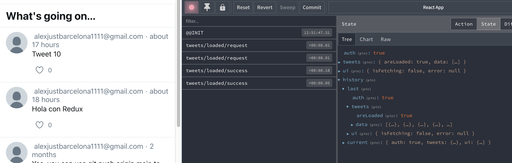

---

El punto es que podemos meter lógica dentro del reduce.

La idea de un `historyReducer` es bastante interesante y útil en ciertas aplicaciones, especialmente cuando deseas mantener un historial de estados o acciones para poder navegar entre ellos. Es una técnica que se ve a menudo en herramientas de desarrollo o en aplicaciones que requieren una funcionalidad de "deshacer" y "rehacer".

Aquí tienes un ejemplo práctico de cómo podrías usar un `historyReducer` en tu aplicación:

**Ejemplo Práctico: Funcionalidad de Deshacer y Rehacer en un Editor de Texto**

Supongamos que estás creando una aplicación de edición de texto en línea. Una característica útil para los usuarios podría ser la capacidad de deshacer y rehacer sus cambios. Aquí es donde un `historyReducer` puede ser muy valioso.

1. **Mantener el Historial de Cambios:**
   Cada vez que el usuario realiza una acción que altera el texto (como escribir, borrar, formatear), el estado actual antes del cambio se añade al historial.

2. **Deshacer Cambios:**
   Cuando el usuario quiere deshacer un cambio, puedes disparar una acción, por ejemplo, `UNDO_ACTION`.
   El `historyReducer` maneja esta acción volviendo al estado previo y actualizando el estado actual con este estado anterior.

3. **Rehacer Cambios:**
   Similarmente, para rehacer, puedes tener una acción `REDO_ACTION`.
   El reducer manejaría esta acción volviendo al estado que se había deshecho si está disponible.

Este `historyReducer` es un emboltorio alrededor del reducer de la aplicación que maneja el estado de la aplicación (`present`), así como listas de estados pasados (`past`) y futuros (`future`). Al realizar acciones de deshacer o rehacer, navega a través de estas listas para actualizar el estado actual.

**Beneficios de Usar `historyReducer`**

- **No Contamina los Reducers Existentes:** Al ser un emboltorio, no necesitas cambiar la lógica de tus reducers existentes.
- **Flexibilidad:** Puedes grabar acciones específicas o estados específicos, dependiendo de cómo configures tu `historyReducer`.
- **Desacoplamiento:** El historial de estados se maneja fuera del estado principal de la aplicación, manteniendo la lógica de la aplicación limpia y enfocada en su propósito principal.


El `historyReducer` te permite agregar una funcionalidad de historial a tu aplicación sin afectar la lógica de negocio central. Puede ser extremadamente útil para funciones de deshacer/rehacer o para depurar y entender la secuencia de acciones y cambios de estado en tu aplicación.

El concepto de un `historyReducer` puede ser aplicado en una variedad de contextos de aplicación más allá de un editor de texto. Aquí hay algunos ejemplos de cómo podrías aplicarlo:

* **Juegos con Función de Deshacer** En un juego de rompecabezas o estrategia, los jugadores podrían beneficiarse de la capacidad de deshacer y rehacer movimientos. El `historyReducer` podría rastrear el estado del juego después de cada movimiento, permitiendo a los jugadores retroceder a un punto anterior si hacen un error o quieren probar una estrategia diferente.

* **Aplicaciones de Dibujo o Diseño** Las aplicaciones que permiten a los usuarios crear o editar imágenes suelen tener una función de deshacer. El historyReducer podría manejar el historial de cambios en el lienzo, permitiendo a los usuarios deshacer trazos o ediciones.

* **Formularios Dinámicos y Aplicaciones de Encuestas** En aplicaciones complejas con formularios dinámicos o encuestas, donde los usuarios pueden agregar o quitar secciones, el historyReducer podría ser útil para permitir a los usuarios deshacer la adición o eliminación de elementos del formulario.

* **Administración de Estado en Aplicaciones de Software de Negocios** En aplicaciones de CRM o ERP, donde los usuarios pueden realizar múltiples cambios en los datos, como actualizar registros de clientes o inventario, el historyReducer podría ofrecer un historial de cambios, dando a los administradores la capacidad de revisar o revertir acciones si es necesario.

* **Desarrollo Web y Herramientas de Diseño** Herramientas de desarrollo web como editores de código o plataformas de diseño podrían usar un historyReducer para permitir a los usuarios deshacer cambios en el código o en el diseño. Esto sería particularmente útil en un entorno colaborativo donde varios cambios pueden ser introducidos y revertidos rápidamente.

## Sígnals - MobX (otros redux)

Estamos hablando de redux como solución al estado en aplicaciones react  
Hay muchas otras formas de manejo de estado  
Sígnals he leído algo pero no lo conozco bien  

https://purtiaggarwal1997.medium.com/react-data-fetching-using-axios-with-hooks-e6400aa44e19

https://javascript.plainenglish.io/signals-a-performant-alternative-to-react-hooks-ecdd6de61f62


## TypeScript con Redux

https://redux.js.org/usage/usage-with-typescript


---

## Pasarelas de pago

https://www.youtube.com/watch?v=rl4tyTNUg6k

Normalmente front + back. Al final el backend es un entorno más seguro y pondrás ahí las cosas más delicadas. Por ejemplo,  si tu integración con la pasarela depende de una secret key, no querrás exponer esa key en el front y necesitarás una capa de backend.  Pero la entrada de datos del usuario se produce desde el front.
Por ejemplo, con esta library

https://docs.monei.com/docs/integrations/use-payment-modal/

## Escribiendo Test unitarios (test funcional) - React Redux unitest

Para saber una vez escritos los test, saber cuánta covertuda de código testeado has hecho, lo haría así

```sh
# npm run test -- --coverage
npm run test -- --coverage --watchAll=false
```

Para unidades pequeñas de la app. Para todo el flujo tendrías por ejejmplo `Playwright` pero no es ete caso.

Testar todo lo que tiene que ver con Redux y React

Yes ejecuta los test (redux)

* Acciones asíncronas
* Acciones síncronas
* Reducers
* Selectores
* Componentes

Usaremos jest para ejecutar nuestros tests: https://jestjs.io/

https://testing-library.com/

https://kentcdodds.com/blog/fix-the-not-wrapped-in-act-warning


Con create-react-app ya viene configurado

```json
  "dependencies": {
    "@redux-devtools/extension": "^3.3.0",
    "@testing-library/jest-dom": "^5.17.0",
    "@testing-library/react": "^13.4.0",
    "@testing-library/user-event": "^13.5.0",
```


```sh
npm run test
```

Excepto en las acciones asíncronas, no tendremos necesidad de mocks de funciones

---
### Síncronas


**Test funciones actions síncronas**

Cómo testear un action creator síncrono:

*  Creamos el objeto con la acción esperada
* Ejecutamos el action creator
* Comprobamos que el resultado del action creator coincide con la acción esperada

Si quieres te puedes crar una carpeta `test` siempre al lado de los ficheros que estamos testeando.  
En este caso ahora vamos a testear `actions.js`

arrancamos el test 

```sh
npm run test
```
Te dará error porque no hay ningún test escrito.


Testeamos estas funciónes de `actions.js`:

```js
export const authLoginSuccess = () => ({
  type: AUTH_LOGIN_SUCCESS,
});

export const tweetsLoadedSuccess = tweets => ({
  type: TWEETS_LOADED_SUCCESS,
  payload: tweets,
});
```

Me creo el archivo de testeo: 

`store/test/action.js` 

```js
describe() // sirve para acul¡mular test

it() // dentro crearemos el test

test() // es lo mismo que it
```

```js
describe('authLoginSuccess', () => {
  test('should return an "AUTH_LOGIN_SUCCESS" action', () => {
    const expectedAction = {
      type: AUTH_LOGIN_SUCCESS,            // esto espero que me retorne
    };
    const action = authLoginSuccess();     // ejecuto la función para testear
    expect(action).toEqual(expectedAction);// compruebo que action es lo mismo que expectedAction
  });
});

describe('tweetsLoadedSuccess', () => {
  it('should return a "TWEETS_LOADED_SUCCESS" action with payload', () => {
    const tweets = 'tweets';               // le paso lo que sea
    const expectedAction = {
      type: TWEETS_LOADED_SUCCESS,
      payload: tweets,
    };
    const action = tweetsLoadedSuccess(tweets);
    expect(action).toEqual(expectedAction);
  });
});
```

La utilidad de estos test no es tanto que esté testeando el codigo actual, qué ocurre si dentro de 6 meses estamos desarolando algo nuevo y se modifica la acción `tweetsLoadedSuccess`? el test te da el aviso, te darás cuenta dle cambio en el mismo momento de que el test no pasa y se abrirá el debate de si esta función hay que cambiarla o no.


**Test funciones reducers síncronas**

En estos reducers radica gran parte de lógica de mi aplicacion. Cuanta más combinaciones testee mejor.

`store/test/reducers.js` 

```js
import { authLoginSuccess, 
         authLogout, 
         tweetsCreatedRequest } from '../actions';
import { auth, 
         defaultState } from '../reducers';

// pasa por este codigo --> function auth(state, action)
describe('auth', () => {
  test('should manage "AUTH_LOGIN_SUCCESS" action', () => { // return true;
    const state = defaultState.auth;   // estado actual
    const action = authLoginSuccess(); // cuando lanzo la accion
    expect(auth(state, action)).toBe(true); // el estado debe ponerse true 
  });
  test('should manage "AUTH_LOGOUT" action', () => { // return false;
    const state = defaultState.auth;
    const action = authLogout();
    expect(auth(state, action)).toBe(false);
  });
  test('should manage "ANY" action', () => { // return state;
    const state = defaultState.auth;
    const action = tweetsCreatedRequest();
    expect(auth(state, action)).toBe(state);
  });
  // cuando el estado es indefinido, es decir cuando se inicia ha de cojer 
  // por defecto function auth(state = defaultState.auth
  test('should manage "ANY" action when state is not defined', () => {
    const state = undefined;
    const action = tweetsCreatedRequest();
    expect(auth(state, action)).toBe(defaultState.auth);
  });
});
```

**Test funciones selectors síncronas**


`store/test/selectors.js` 

```js
//export const getTweet = tweetId => state =>
//  getTweets(state).find(tweet => tweet.id === Number(tweetId));

import { getTweet } from '../selectors';

describe('getTweet', () => { // le paso justo la info básica que quiero
  const tweetId = '1';
  const tweets = [{ id: +tweetId }];
  const state = { tweets: { data: tweets } };

  test('should return a tweet by tweetId', () => {
    expect(getTweet(tweetId)(state)).toBe(tweets[0]); // le paso la info y buscará que coincida 1
  });

  test('should not return any tweet', () => {
    expect(getTweet('2')(state)).toBeUndefined(); // le paso la info para que falle
  });
});
```

---
### Asíncronas

**Test authLogin**

Esta acción lo que hace es que le pasamos unos parámetros y nos devuelve la función de la acción en si

`export function authLogin(credentials) {`  
`  return async function (dispatch, getState, { api: { auth }, router }) {`  
`    try {`  

```js
import {
  authLogin,
  authLoginFailure,
  authLoginRequest,
  authLoginSuccess,
  tweetsLoadedSuccess,
} from '../actions';
import { AUTH_LOGIN_SUCCESS, TWEETS_LOADED_SUCCESS } from '../types';


describe('authLogin', () => {
  const credentials = 'credentials'; // sólo quiero que vaya al metodo auth.login()
  const action = authLogin(credentials); // ¿qué pasa si internamente falla?
                                         // a esta accion le hemos de pasar (dispatch, getState, { api: { auth }, router })

  const redirectUrl = 'redirectUrl';
  const dispatch = jest.fn(); // me vale con que sea una funcion, la más sencilla
  const api = { auth: {} };   // inyecto objeto api
  const router = {            // inyecto router
    state: { location: { state: { from: { pathname: redirectUrl } } } },
    navigate: jest.fn(),
  };
  // me creo los test
  test('when login resolves should follow the login flow', async () => {
    api.auth.login = jest.fn().mockResolvedValue(); // tiene que acabar resolviendo a un valor, una promesa resuelta
    await action(dispatch, undefined, { api, router }); // await has de esperar que se cumpla la función

    expect(dispatch).toHaveBeenCalledTimes(2);
    // dispatch llama dos veces, la segunda con authLoginRequest
    expect(dispatch).toHaveBeenNthCalledWith(1, authLoginRequest()); 
    // que las credenciales que le paso al inicio para la acción lleguen al metodo login
    expect(api.auth.login).toHaveBeenCalledWith(credentials); 
    expect(dispatch).toHaveBeenNthCalledWith(2, authLoginSuccess());
    expect(router.navigate).toHaveBeenCalledWith(redirectUrl);
  });

  test('when login rejects should follow the error flow', async () => {
    const error = new Error('unauthorized');
    api.auth.login = jest.fn().mockRejectedValue(error);
    await action(dispatch, undefined, { api, router });

    expect(dispatch).toHaveBeenCalledTimes(2);
    expect(dispatch).toHaveBeenNthCalledWith(1, authLoginRequest());
    expect(api.auth.login).toHaveBeenCalledWith(credentials);
    expect(dispatch).toHaveBeenNthCalledWith(2, authLoginFailure(error));
    expect(router.navigate).not.toHaveBeenCalledWith(redirectUrl);
  });
});
```


****

le paso esto al `store/actions.js`

```js
import * as auth from '../pages/auth/service';
```

Si quiero mokear este modulo lo que haría sería

```js
import {
  authLogin,
  authLoginFailure,
  authLoginRequest,
  authLoginSuccess,
  tweetsLoadedSuccess,
} from '../actions';
import { AUTH_LOGIN_SUCCESS, TWEETS_LOADED_SUCCESS } from '../types';

// importo
import * as auth from '../pages/auth/service';
// creo el jest
jest.mock(`../../page(auth/service.js`);

// y esto tendría acceso a 
console.log(auth.login)
```
... pero debes arreglar esto:

Mediante esta opción puedes pasarle un array de estrings que diga que por efecto el va a no transformar el node_modules exepto axios. Si quiero que ignore axios le digo esto al package.json

```json
  "jest": {
    "transformIgnorePatterns": [
      "/node_modules/(?!(axios)/)"
    ]
  }
```

**Test de snapshost**

El "Test de Snapshot" o prueba de instantánea es un concepto utilizado generalmente en el ámbito de la informática y la gestión de datos. Se refiere a la captura del estado de un sistema o conjunto de datos en un momento específico. Este tipo de prueba es útil para verificar el estado actual de un sistema o para realizar comparaciones antes y después de cambios o actualizaciones. En bases de datos, por ejemplo, un test de snapshot podría implicar tomar una copia de todos los datos en un punto específico en el tiempo para su análisis o respaldo.

https://testing-library.com/docs/

`auth/LoginPage/__test__/LoginPage.js`

```js
import { act, render, screen } from '@testing-library/react'; // para el test de funcionamiento
import LoginPage from '../LoginPage';
import { Provider } from 'react-redux';
import { authLogin } from '../../../../store/actions';
import userEvent from '@testing-library/user-event';

jest.mock('../../../../store/actions');

const userType = (input, text) => userEvent.type(input, text);

describe('LoginPage', () => {
  const state = { ui: { isFetching: false, error: null } }; //const { isFetching, error } = useSelector(getUi);
  const store = {
    getState: () => state,
    subscribe: () => {},
    dispatch: () => {},
  };
  
  // le paso al render mi compnente LoginPage
  const renderComponent = () =>
    render(
      <Provider store={store}>
        <LoginPage />
      </Provider>,
    );

  test('snapshot', () => {
    const { container } = renderComponent();
    expect(container).toMatchSnapshot();
  });

  // vamos a rellenar los imputs de usuario y los botones, los rellenamos y vemos si pasa el test.
  // debería despacharse dispatch(authLogin(credentials));

  test('should dispatch authLogin action', () => {
    const username = 'keepcoder';
    const password = 'password';
    renderComponent();

    const usernameInput = screen.getByLabelText(/username/);
    const passwordInput = screen.getByLabelText(/password/);
    const submitButton = screen.getByRole('button');

    expect(submitButton).toBeDisabled();

    fireEvent.change(usernameInput, { target: { value: username } });
    fireEvent.change(passwordInput, { target: { value: password } });

    expect(submitButton).toBeEnabled();

    fireEvent.click(submitButton);

    expect(authLogin).toHaveBeenCalledWith({ username, password });
  });
});

```

Cuando ejecutes este test por primera vez, Jest creará un archivo de snapshot dentro de una carpeta `__snapshots__` en el mismo directorio que tu archivo de test. En futuras ejecuciones, Jest comparará la salida renderizada con este snapshot para detectar cambios. Si en algún momento necesitas actualizar el snapshot (por ejemplo, después de un cambio intencionado en el componente), puedes hacerlo ejecutando Jest con la opción `--updateSnapshot` o `-u`. 

Si cambias algo, tu foto hará que falle hasta que actualices tu snapshot. Puedes ejecutar tantos como quieras.


https://testing-library.com/docs/ 

```json
  "dependencies": {
    "@redux-devtools/extension": "^3.3.0",
    "@testing-library/jest-dom": "^5.17.0",
    "@testing-library/react": "^13.4.0",
    "@testing-library/user-event": "^13.5.0",
```

**Writing test with userEvent**

```js
  test('should dispatch authLogin action', async () => {
    const username = 'keepcoder';
    const password = 'password';
    renderComponent();

    const usernameInput = screen.getByLabelText(/username/);
    const passwordInput = screen.getByLabelText(/password/);
    const submitButton = screen.getByRole('button');

    expect(submitButton).toBeDisabled();

    // fireEvent.change(usernameInput, { target: { value: username } });
    act(() => {
      userEvent.type(usernameInput, username);
    });
    // fireEvent.change(passwordInput, { target: { value: password } });
    act(() => {
      userEvent.type(passwordInput, password);
    });

    expect(submitButton).toBeEnabled();

    // fireEvent.click(submitButton);
    await userEvent.click(submitButton);

    expect(authLogin).toHaveBeenCalledWith({ username, password });
  });
});
```

quedando así, analízalo bien linea a linea lo que cambia.

```js
import { act, render, screen } from '@testing-library/react';
import LoginPage from '../LoginPage';
import { Provider } from 'react-redux';
import { authLogin } from '../../../../store/actions';
import userEvent from '@testing-library/user-event';

jest.mock('../../../../store/actions');

const userType = (input, text) => userEvent.type(input, text);

describe('LoginPage', () => {
  const state = { ui: { isFetching: false, error: null } };
  const store = {
    getState: () => state,
    subscribe: () => {},
    dispatch: () => {},
  };

  const renderComponent = () =>
    render(
      <Provider store={store}>
        <LoginPage />
      </Provider>,
    );

  test('snapshot', () => {
    const { container } = renderComponent();
    expect(container).toMatchSnapshot();
  });

  test('should dispatch authLogin action', async () => {
    const username = 'keepcoder';
    const password = 'password';
    renderComponent();

    const usernameInput = screen.getByLabelText(/username/);
    const passwordInput = screen.getByLabelText(/password/);
    const submitButton = screen.getByRole('button');

    expect(submitButton).toBeDisabled();

    // fireEvent.change(usernameInput, { target: { value: username } });
    await act(() => userType(usernameInput, username));
    // fireEvent.change(passwordInput, { target: { value: password } });
    await act(() => userType(passwordInput, password));

    expect(submitButton).toBeEnabled();

    // fireEvent.click(submitButton);
    await userEvent.click(submitButton);

    expect(authLogin).toHaveBeenCalledWith({ username, password });
  });
});
```

# Consejos muy importantes

Te recomiendo que hagas test siempre. Son super importantes. Es tan importante el test como a implementación. 

Usa e implementa la lógica mientras haces código:

**Test Driven Development (TDD)** 

es una metodología de desarrollo de software que sigue un ciclo repetitivo muy específico. El objetivo principal es asegurarse de que el código escrito sea confiable y cumpla con los requisitos de diseño antes de avanzar en más funciones o componentes del software. Aquí está el ciclo básico de TDD:

**Escribir una prueba:** Antes de escribir el código funcional, el desarrollador escribe una prueba automatizada que define una mejora deseada o una nueva función. Esta prueba fallará inicialmente, ya que aún no existe el código que cumpla con los requisitos de la prueba.

**Escribir el código:** El desarrollador escribe el código mínimo necesario para que la prueba pase. Este código no necesita ser perfecto; el objetivo es simplemente pasar la prueba.

**Refactorizar el código:** Una vez que la prueba pasa, el desarrollador puede limpiar y optimizar el código, asegurándose de que sigue los estándares de calidad y diseño. Es crucial que las pruebas existentes sigan pasando después de la refactorización.

**Repetir:** Este ciclo se repite para cada nueva característica o mejora en el software. Se agregan más pruebas y se escribe más código, siempre asegurándose de que todas las pruebas pasen.

