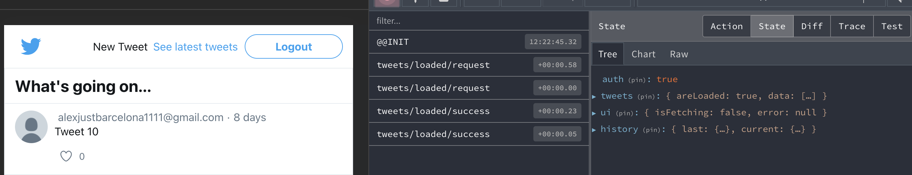

> [!NOTE] 
> SLIDES -> https://github.com/alexjust-data/FullStack07_React_app_tweeter_REDUX/blob/main/Redux.pdf
> 
> Teacher :   
> David https://github.com/davidjj76  
> Discord : https://discord.com/channels/1112689497642115172/1112689499605049377
>
> Refactorizamos : https://github.com/KeepCodingWeb15/twitter-react/tree/redux  
> En la nueva rama : https://github.com/KeepCodingWeb15/twitter-react/tree/rtk
> 
> https://github.com/KeepCodingWeb15  


Partimos de las clases del repositorio de fundamentos React, de la rama creada `rtk`


```sh
git clone -b rtk https://github.com/KeepCodingWeb15/twitter-react.git
cd twitter-react 
  twitter-react git:(rtk) 
```

Arranco Sparrest


```sh
➜  cd '/Volumes/G-DRIVE with Thunderbolt/BOODCAMP/sparrest.js'
➜  sparrest git:(main) ✗ npm start                                            

> sparrest@1.0.0 start
> node index.js

JSON Server is running on port 8001
```

Arranco la aplicación


```sh
npm start

Compiled successfully!

You can now view twitter-react in the browser.

  Local:            http://localhost:3000
  On Your Network:  http://192.168.1.112:3000

Note that the development build is not optimized.
To create a production build, use npm run build.

webpack compiled successfully
```

---

> [!NOTE]
> A partir de ahora es una continuacion de mis apuntes que parten del repo :
> https://github.com/alexjust-data/FullStack07_React_app_tweeter_REDUX.git 


# Redux toolkits (React Redux app)
> [!WARNING]  
> Vamos a refectorizar toda la app con https://redux-toolkit.js.org/


```sh
npm install @reduxjs/toolkit
```

Me voy a cargar la dependencia que ya teníamos instalada porque ya viene con `@reduxjs/toolkit` por defecto


```json
"@redux-devtools/extension": "^3.3.0",
"redux": "^5.0.1",
"redux-thunk": "^3.1.0",
```

```sh
# elimino carpeta y contenidos
rm -rf node_modules

# instalo todas las dependencias listadas (creo node_modules)
npm i
```

## Dependencias de la creación del estado

`store/index.js`

```js
// ANTES
import { createStore, combineReducers, applyMiddleware } from 'redux';
import { withExtraArgument } from 'redux-thunk';
import { composeWithDevTools } from '@redux-devtools/extension';

import * as reducers from './reducers';
import * as actionCreators from './actions';
import * as tweets from '../pages/tweets/service';
import * as auth from '../pages/auth/service';

// DESPUES
import { configureStore as rtkConfigureStore } from '@reduxjs/toolkit';

import * as reducers from './reducers';
import * as actionCreators from './actions';
import * as tweets from '../pages/tweets/service';
import * as auth from '../pages/auth/service';
```

En realidad vamos a seguir configurando nuestra función `configureStore` que será más sencillo porque hay cosas que ya estarán hechas.

```js
// ANTES 
export default function configureStore(preloadedState, { router }) {
  const middleware = [
    withExtraArgument({ api: { auth, tweets }, router }),
    timestamp,
    failureRedirects(router, { 401: '/login', 404: '/404' }),
    logger,
    noAction,
  ];
  const store = createStore(
    reducer: historyReducer(combineReducers(reducers));
    preloadedState,
    composeEnhancers(applyMiddleware(...middleware)),
  );
  return store;
}

/**
 * El Store se crea llamando al paquete store = rtkConfigureStore
 * Propiedades : 
 * - reducer: reducers (el objeto con todos nuestros reducers)
 * - preloadedState,
 * - Por defecto el Thunk ya está, te lo da hecho
 **/


// DESPUES sin middelware
export default function configureStore(preloadedState, { router }) {
  const extraMiddleware = [
    timestamp,
    failureRedirects(router, { 401: '/login', 404: '/404' }),
    successRedirects(router),
    logger,
  ];
  const store = rtkConfigureStore({
    reducer: reducers,
    preloadedState,
    devTools: { // si no pasamos nada en middelware
      actionCreators
    }
  });
  return store;
}

// DESPUES con middelware que nos hacemos cargo nosotros
export default function configureStore(preloadedState, { router }) {
  const extraMiddleware = [
    timestamp,
    failureRedirects(router, { 401: '/login', 404: '/404' }),
    successRedirects(router),
    logger,
  ];
  const store = rtkConfigureStore({
    reducer: reducers,
    preloadedState,
    middleware: getDefaultMiddleware => 
      getDefaultMiddleware({ 
        // Configuración específica para el middleware predeterminado.
        thunk: { extraArgument: { api: { auth, tweets } } }, // Configuración adicional para el middleware thunk, como argumentos extra.
        serializableCheck: false, // Útil si se manejan datos no serializables en las acciones.
      }).concat(extraMiddleware), // Añade middleware adicional usando 'concat'.

    // potenciadores : 'enhancers' es una función que recibe 'getDefaultEnhancers'.
    enhancers: getDefaultEnhancers => 
      getDefaultEnhancers().concat(historyEnhancer), // Añade potenciadores adicionales usando 'concat'.
});
  return store;
}
```

comprueba que toda vaya bien


```sh
npm start
```

los estados están funcionando y estamos guardando el history, entonces funciona el `enhancers` para el `historyEnhancer`



```js
    enhancers: getDefaultEnhancers =>
      getDefaultEnhancers().concat(historyEnhancer),
```

Las acciones tienen el meta con el timestamp, luego su middelware está funcionando


```sh
export default function configureStore(preloadedState, { router }) {
  const extraMiddleware = [
    timestamp,
```

En consola vemos como están los console, entonces `logger` está funcionando


```sh
export default function configureStore(preloadedState, { router }) {
  const extraMiddleware = [
    timestamp,
    failureRedirects(router, { 401: '/login', 404: '/404' }),
    successRedirects(router),
    logger,
  ];
```

Pues con esto ya tenemos todo lo que teníamos habiendo quitado todas las dependencias. No necesitamos ni las devTools otras cosas, pero tenemos que configurar el middelware. Y aún así tenemos acceso a todo igual que si hiciéramos a mano como anteriormente.

## Trabajando el fichero de acciones

`store/actions.js`

utilidad `creacteactions` para crear 
